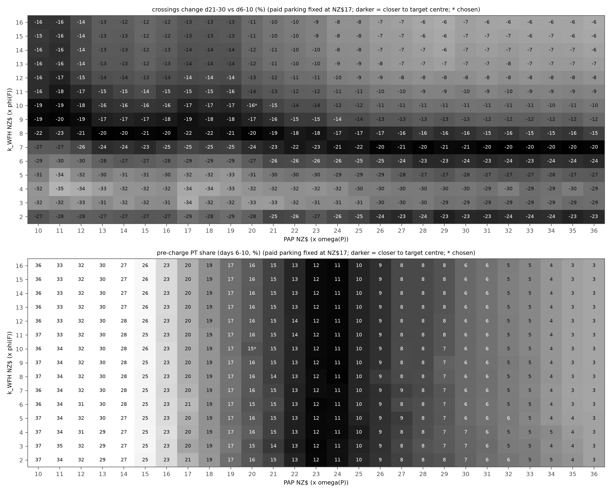
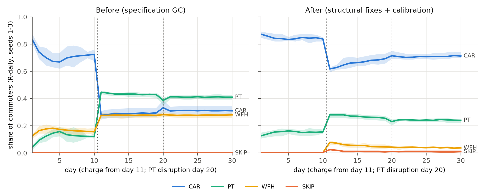
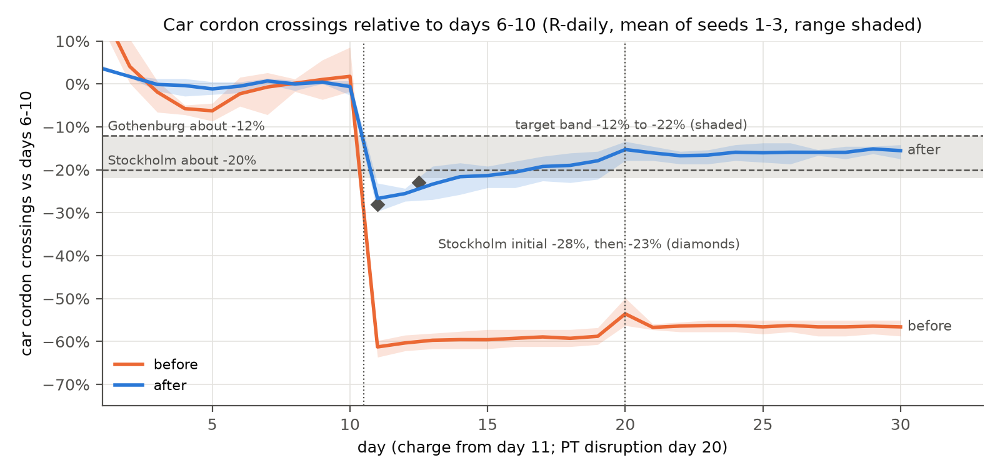
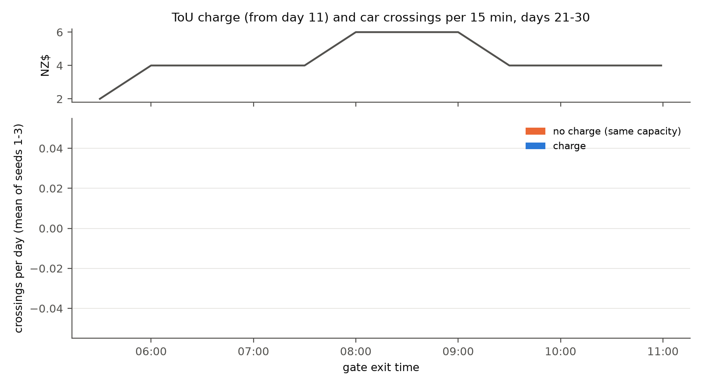

# Behaviour calibration report

Generated by `scripts/calibrate_behaviour.py` (data: `data/behaviour_calibration.json`). R-daily arm, rule decider, PyEngine, n = 300, 30 days, seeds 1-3 (held-out seeds 4-5 and, after the selection, unseen seeds 6-12 for checking only). The LLM arms are never calibrated. Capacity is recalibrated per seed and per evaluated point with `cordonlite.run.calibrate` (car-weighted peak 15-min queue delay of 15 min, days 6-10, no charge).

## Targets (all stated assumptions)

| Target | Band | Centre | Meaning |
|---|---|---|---|
| `base_car` | 0.75 to 0.85 | 0.8 | car share, mean of days 6-10 (pre-charge), R-daily |
| `base_pt` | 0.08 to 0.15 | 0.115 | PT share, days 6-10 |
| `base_wfh` | 0 to 0.1 | - | WFH share, days 6-10 (at most) |
| `base_skip` | 0 to 0.02 | - | SKIP share, days 6-10 (at most) |
| `change_21_30` | -0.22 to -0.12 | -0.2 | car cordon crossings, mean days 21-30 vs mean days 6-10 |
| `change_11_13` | -0.3 to 0 | - | overshoot, mean days 11-13 vs days 6-10 (may reach about -30%) |

Response anchors: Stockholm about -20% (an initial -28%, then -23%, settling at 20-22%), Gothenburg about -12% (Börjesson et al. 2012, Transport Policy 20:1-12; Börjesson and Kristoffersson 2015, TR-A 75:134-146). Single-seed tolerance: shares ±0.05, response ±4 pp.

**Comparability of the anchors.** The Stockholm and Gothenburg figures are reductions of total cordon-crossing traffic in charged hours (all vehicles and purposes), observed over months to years. v3 section 10.5 lists them as soft checks, notes that private-car elasticities (-0.85 to -1.9) are about twice the total-traffic ones (-0.4 to -0.9), and asks for the comparison to be reported as qualitative only. The target here is a hard band on AM car-commuter crossings over days 21-30, and days 11-13 stand in for Stockholm's early -28% then -23%. A private-car commuter response is likely larger than the total-traffic one, and the observed trajectory unfolded over months, not days. The band is therefore a stated assumption that puts the rule arm in a plausible range, not a validation. Auckland-specific support is indicative only: AT option 1a (v3 10.5) implies AM-peak vehicle trips of about -3,600 against about 19,000 charged vehicles (about 19%).

## Structural fixes (applied before the search)

- **memory.ref_fee_update**: all_days (EMA of the fee PAID, 0 on non-car days) -> faced (EMA, alpha = memory.ema_alpha, of the fee FACED at the car reference departure on every day). [v3 5.2 fee-ref, with two differences [A]: on car days the fee actually paid (after retiming) rather than the fee at h0, and alpha 0.3 (SPEC) rather than 0.2]. With the paid fee, agents who left the car kept a reference of 0 and a loss term on the full fee for ever, so the day-11 response could not fade.
- **traits.eta**: [0, 0.5, 1, 2, 3] -> [0, 0.25, 0.5, 0.75, 1]. [v3 4.4 capped variant; De Borger and Fosgerau 2008: a total weight of 4 is generous]. The loss term was larger than the fee itself for day-11 leavers.
- **costs.wfh_form**: spec (WFH = k_WFH x phi; saves car time and parking) -> v3_relative (WFH = k_WFH x phi + VoT/60 x free-flow time + parking + fuel). [v3 6.2: WFH has no PARK term; zero-fee property]. WFH no longer earns the commute, parking and fuel as savings; it still avoids congestion delay, schedule delay and the charge.
- **costs.fuel_cost_per_km**: 0 (no fuel cost; v3 folded fuel into its parking value) -> 0.30 NZ$/km, fixed input (petrol NZ$3.30/L [author-supplied, Oct 2026] x 9.0 L/100 km); car fuel = 2 x path_km x 0.30, 0 for company cars. Driving cost only time, schedule delay, charge and parking, so a calibrated parking value also stood for fuel. Fuel is explicit and is not a calibration scalar.
- **persona.park_cost_paid**: [8, 8, 8, 0, 6] [v3], then searched (17 without fuel, 11 with fuel 0.23) -> [17, 17, 17, 0, 12.75], fixed input [author decision; consistent with the AT 2014 Victoria St daily rate]. Paid parking is set from real-world knowledge and is no longer a calibration scalar.
- **clock.discontinuity_triggers**: [T1, T2, T4, T6] -> [T1, T4, T6]. [A, Verplanken et al. 2008]: habit discontinuity is a change of the performance context; a price change leaves route, time and cues intact, so kappa_H is no longer halved at the charge wake.
- **costs.pt_attitude_penalty**: 0 -> PAP x omega(P), searched in 10-36. [v3 6.2 PAP NZ$8, swept {4, 8, 12}, in v3's form omega(P) x PAP x HTA/2]; free scalar 1 of 2 (the other is k_WFH, searched in 2-16), entered in the specification form omega(P) x (VoT/60 x T_pt + PAP), so the value is not comparable with v3's.
- **engine capacity**: seed-1 scale used for every seed -> recalibrated per seed and per evaluated point; data/calibration.json holds by_seed records. Pre-charge congestion feeds back on the response.

## Early start and SKIP cost (author decisions, 2026-10-05)

Two assumptions changed before this search, and neither is searched. **Cost of postponing**: `costs.skip_cost` = NZ$30 plus 1 hour of VoT [A, author decision 2026-10-05; raised with the driving cost] (NZ$25 before). **Early start**: a commuter whose employer allows it (Layer A constraint `early_shift_ok`, probability by archetype [0.8, 0.5, 0.0, 0.5, 0.0] for hybrid office, on-site office, shift/service, trades/work vehicle and tertiary student [A]) may start work at 07:00 instead of the usual start t* (07:00 to 15:00 [A, author: employers encourage it]). Every car and PT option of such a commuter is measured against the cheaper of the two starts: schedule delay against t*, or schedule delay against the early start plus NZ$3 x phi(F) a day [A]. The car departures around the reference departure of each start (+/- 15 min) are added to the standing +/- 60 min set. Early and late minutes, lateness for T3 and the stored outcome use the start the chosen option implies. The LLM prompt states the permission and shows the start time of every option. Targets, seeds (1-3 search, 4-5 held out, 6-12 out of sample), loss, selection rule, grid and the two searched scalars (PAP, k_WFH) are unchanged. The earlier state is archived in `data/behaviour_calibration_skip25_noearly.json` with `docs/calibration_report_skip25_noearly.md`.

Early start, retiming, postponing and peak spreading at the chosen point (R-daily; 'no charge' is the run without the charge at the same capacity and seed, which has the same day-to-day churn):

| Seed | may start early | early start d6-10 | d11-13 | d21-30 | d21-30, no charge | SKIP d6-10 | SKIP d21-30 | retimed (of all commuters) | same, no charge | crossings d21-30 vs d6-10, all morning | 08:00-09:00 | before 07:30 | 08:00-09:00, no charge |
|---|---|---|---|---|---|---|---|---|---|---|---|---|---|
| 1 | 0.410 | 0.071 | 0.073 | 0.037 | 0.071 | 0.001 | 0.002 | 0.353 | 0.423 | -15.2% | -13.7% | -9.0% | -0.4% |
| 2 | 0.503 | 0.064 | 0.048 | 0.035 | 0.070 | 0.001 | 0.007 | 0.290 | 0.373 | -17.8% | -16.8% | -18.9% | -3.8% |
| 3 | 0.497 | 0.049 | 0.072 | 0.054 | 0.042 | 0.006 | 0.020 | 0.320 | 0.303 | -15.0% | -25.4% | -5.6% | +7.4% |
| 4 (held out) | 0.477 | 0.059 | 0.040 | 0.047 | 0.064 | 0.000 | 0.006 | - | - | -15.4% | -30.1% | +3.8% | +1.2% |
| 5 (held out) | 0.477 | 0.055 | 0.062 | 0.040 | 0.071 | 0.002 | 0.008 | - | - | -18.1% | -26.6% | -5.2% | -2.3% |
| mean 1-3 | 0.470 | 0.061 | 0.064 | 0.042 | 0.061 | 0.003 | 0.010 | 0.321 | 0.367 | -16.0% | -18.6% | -11.2% | +1.0% |

'Early start' is the share of all commuters whose day is measured against the early start (car or PT), mean over the days. 'Retimed' counts commuters whose modal option is a car departure on days 6-10 and on days 26-30 with a different modal departure (an early-start departure counts). Mean of seeds 1-3: 47.0% of commuters may start early; 6.1% do so before the charge and 4.2% on days 21-30 (6.1% in the no-charge run); as a share of car users 7.3% and 6.0%. 32.1% of commuters retime their drive (11.1% earlier, 21.0% later), against 36.7% without the charge. SKIP is 0.003 before and 0.010 after. Car crossings change by -16.0% over the whole morning and by -18.6% in the 08:00 to 09:00 peak (NZ$6), against -11.2% before 07:30 (NZ$4); without the charge the peak changes by +1.0% over the same days.

## Parking and fuel fixed by the authors

Two inputs are fixed from real-world knowledge and are not calibrated (2026-10-03). **Paid parking** is NZ$17 a day for office archetypes (student NZ$12.75; trades and company vehicles 0) [author decision; consistent with the AT 2014 Victoria St daily rate already noted in config comments]. It was a searched scalar before (NZ$17 without a fuel cost, NZ$11 with fuel at NZ$0.23/km). **Fuel** is 2 x path_km x NZ$0.30/km (round trip, to the cent; 0 for company cars and work vehicles): petrol NZ$3.30/L [author-supplied, Oct 2026] x 9.0 L/100 km (Metcalfe and Sridhar 2016 for the Ministry of Transport) = 0.297, rounded to 0.30; mean NZ$8.6 a day for a driver who pays it (seeds 1-3: 8.5, 8.7, 8.8). The petrol price was supplied by the authors and has not been verified against a published series here (the MBIE weekly series gave NZ$2.53/L for September 2025 and NZ$2.97/L for September 2026). Under `wfh_form = "v3_relative"` WFH carries parking and fuel, so WFH earns no credit for the avoided drive. The prompt of the LLM arms states both daily costs.

The search runs over two scalars only, PAP and k_WFH, with the same targets, seeds, loss and selection rule. Earlier searches are archived: `data/behaviour_calibration_pre_fuel.json` with `docs/calibration_report_pre_fuel.md` (no fuel, three scalars), `data/behaviour_calibration_fuel023_park11.json` with `docs/calibration_report_fuel023_park11.md` (fuel NZ$0.23/km, three scalars) and `data/behaviour_calibration_skip25_noearly.json` with `docs/calibration_report_skip25_noearly.md` (SKIP cost NZ$25, no early start, two scalars).

| | Without fuel (archived) | Fuel NZ$0.23/km, parking searched (archived) | Fuel NZ$0.30/km, parking fixed, SKIP NZ$25, no early start (archived) | SKIP NZ$30 and early start (this report) |
|---|---|---|---|---|
| Fuel cost | none | NZ$0.23/km, fixed | NZ$0.30/km, fixed | NZ$0.30/km, fixed |
| Paid parking, office (student) | NZ$17 (NZ$12.75), searched | NZ$11 (NZ$8.25), searched | NZ$17 (NZ$12.75), fixed | NZ$17 (NZ$12.75), fixed |
| SKIP cost (plus 1 h of VoT) | NZ$25 | NZ$25 | NZ$25 | NZ$30 |
| Early-start option | no | no | no | yes |
| Searched scalars | PAP, parking, k_WFH | PAP, parking, k_WFH | PAP, k_WFH | PAP, k_WFH |
| PAP (x omega(P)) | NZ$11 | NZ$12 (grid edge) | NZ$20 (interior) | NZ$20 (interior) |
| k_WFH (x phi(F)) | NZ$8 (grid edge) | NZ$8 (grid edge) | NZ$10 (interior) | NZ$10 (interior) |
| Feasible points | 2 of 127 (after rounding) | 0 of 178 | 0 of 405 | 6 of 405 |
| Car share d6-10 (0.75-0.85) | 0.853 | 0.835 | 0.830 | 0.843 |
| PT share d6-10 (0.08-0.15) | 0.137 | 0.154 | 0.147 | 0.154 |
| WFH share d6-10 (at most 0.10) | 0.009 | 0.009 | 0.003 | 0.001 |
| SKIP share d6-10 (at most 0.02) | 0.000 | 0.001 | 0.020 | 0.003 |
| Crossings d11-13 vs d6-10 (to about -30%) | -29.4% | -30.9% | -28.8% | -25.2% |
| Crossings d21-30 vs d6-10 (-12% to -22%) | -20.9% | -20.3% | -18.4% | -16.0% |
| Capacity scale (mean of seeds 1-3) | 0.447 | 0.444 | 0.441 | 0.405 |

With parking at NZ$17 and fuel at NZ$0.30/km a paying driver's money cost is about NZ$26 a day before any charge (parking plus fuel), against about NZ$18 in the two earliest states, so PAP is far higher than in those states: it is the one scalar that holds the assumed pre-charge shares. In the third state postponing (NZ$25 plus one hour of VoT) was close to the cost of a day's driving and the SKIP share was 0.020 before the charge; with the SKIP cost at NZ$30 and the early-start option it is 0.003.

## Search

405 grid points x 3 seeds = 1215 evaluations, each with its own capacity calibration. Full grid in NZ$1 steps: PAP 10 to 36, k_WFH 2 to 16, paid parking fixed at NZ$17. The ranges were set after a range-finding probe (PAP 12 to 40 in steps of 4 at k_WFH 8 and 12, seeds 1-3; logged as `search.range_probe`) and before the search. Selection: lexicographic: (1) feasible = every 3-seed mean in its target band at the targets' stated precision (shares to 2 decimals, changes to whole percent) and every seed within the stated single-seed tolerance; (2) among feasible points, the smallest squared relative distance to the anchors (PAP 8 [v3], paid parking 17 [AT car-park all-day rate 2014], k_WFH 8 [v3]); (3) loss as tie-break. If no point is feasible, the lowest loss. Loss: Loss of one grid point over its seeds. centre: sum of squared (3-seed mean - centre) / scale for base car, base PT and the d21-30 response (scales 0.05, 0.035, 0.04); band: squared band excess of the 3-seed means for every target (scale 0.02), plus squared excess beyond the stated single-seed tolerance for each seed; prior: 0.02 x sum of squared relative distances of the scalars from the v3 values (8, 8, 8), a weak tie-break toward the design-note values. Paid parking is constant, so its terms in the anchor distance (0) and in the prior (a constant) do not affect the ranking.

6 of 405 points are feasible at the stated precision (shares to 2 decimals, changes to whole percent); strictly (unrounded 3-seed means) 0 are. The chosen point is pap20_park17_wfh10; the lowest-loss point is pap21_park17_wfh8. Neither chosen value is on an edge of its searched range.

Sensitivity to the soft overshoot bound ('may reach about -30%', treated as a hard bound): bound -30.0%: 6 feasible, chosen pap20_park17_wfh10; bound -31.0%: 6 feasible, chosen pap20_park17_wfh10; bound -32.0%: 6 feasible, chosen pap20_park17_wfh10; bound -33.0%: 6 feasible, chosen pap20_park17_wfh10. The anchors (PAP 8, k_WFH 8) act only inside a feasible set.

Selection history (append-only from this version; `search.selection_history`): Earlier versions of the selection rule and anchors were overwritten by --stage select and are not recoverable from this log. What is known: the coarse grid (paid parking 8, 10, 12, 15, 18) was run first; the paid-parking anchor NZ$17 is not on it and entered with the refinement grid (parking 14-18 at k_WFH 8) along the PAP-parking ridge that the coarse grid had located, so the NZ$17 anchor was fixed after coarse-grid results had been seen. From this version on, --stage select appends the rule, anchors and choice it replaces to this list. 2026-10-03: fuel cost added to the car option (costs.fuel_cost_per_km, fixed from evidence, not searched) and the search rerun with the paid-parking grid moved downward. This replaces the search without fuel, which chose pap11_park17_wfh8 under the same rule and anchors; its full log is kept in data/behaviour_calibration_pre_fuel.json and its report in docs/calibration_report_pre_fuel.md. 2026-10-03: paid parking fixed at NZ$17 by the authors and the fuel cost raised to NZ$0.30/km (author-supplied petrol price for October 2026); parking is no longer searched and the search was rerun over PAP and k_WFH only, on a wider grid. This replaces the three-scalar search with fuel NZ$0.23/km, which chose pap12_park11_wfh8 (no feasible point, lowest loss) under the same rule; its full log is kept in data/behaviour_calibration_fuel023_park11.json and its report in docs/calibration_report_fuel023_park11.md. 2026-10-05: the authors raised the cost of postponing (costs.skip_cost) from NZ$25 to NZ$30 and added the early-start option (employer permission by archetype, 07:00 start, NZ$3 x phi(F) a day); both are fixed assumptions and are not searched. The search was rerun over PAP and k_WFH on the same grid with the same targets, seeds, loss and rule. This replaces the search with SKIP cost NZ$25 and no early start, which chose pap20_park17_wfh10 (no feasible point, lowest loss); its full log is kept in data/behaviour_calibration_skip25_noearly.json and its report in docs/calibration_report_skip25_noearly.md.

Feasible points and the ten lowest-loss points (3-seed means):

| PAP | k_WFH | feasible | anchor dist. | loss | base car | base PT | base WFH | base SKIP | d11-13 | d21-30 |
|---|---|---|---|---|---|---|---|---|---|---|
| 20 | 10 | yes | 2.312 | 3.08 | 0.843 | 0.154 | 0.001 | 0.003 | -25.2% | -16.0% |
| 21 | 8 | yes | 2.641 | 1.93 | 0.852 | 0.145 | 0.001 | 0.002 | -27.8% | -19.2% |
| 21 | 9 | yes | 2.656 | 2.81 | 0.852 | 0.145 | 0.000 | 0.002 | -26.6% | -16.2% |
| 21 | 10 | yes | 2.703 | 3.72 | 0.850 | 0.146 | 0.001 | 0.003 | -23.2% | -14.6% |
| 21 | 11 | yes | 2.781 | 4.84 | 0.850 | 0.146 | 0.001 | 0.003 | -21.4% | -13.1% |
| 21 | 12 | yes | 2.891 | 5.83 | 0.851 | 0.146 | 0.001 | 0.003 | -20.2% | -12.1% |
| 20 | 8 | no | 2.250 | 2.30 | 0.839 | 0.157 | 0.001 | 0.002 | -30.4% | -19.7% |
| 20 | 9 | no | 2.266 | 2.90 | 0.840 | 0.157 | 0.000 | 0.002 | -28.3% | -16.9% |
| 22 | 8 | no | 3.062 | 2.33 | 0.860 | 0.134 | 0.003 | 0.003 | -27.3% | -17.9% |
| 22 | 7 | no | 3.078 | 2.55 | 0.861 | 0.133 | 0.004 | 0.002 | -30.9% | -21.9% |
| 22 | 9 | no | 3.078 | 3.57 | 0.861 | 0.135 | 0.002 | 0.003 | -24.4% | -15.2% |
| 23 | 8 | no | 3.516 | 3.80 | 0.873 | 0.122 | 0.002 | 0.003 | -27.7% | -18.3% |

Chosen: **PAP NZ$20 x omega(P), k_WFH NZ$10 x phi(F)**, with paid parking fixed at NZ$17/day (student NZ$12.75) and fuel fixed at NZ$0.30/km.

How to read the chosen values. PAP enters in the specification form omega(P) x (VoT/60 x T_pt + PAP) + fare: omega also scales PT time, and v3's HTA/2 factor is absent. v3 6.2 uses omega(P) x PAP x HTA/2 (HTA 1 local, 2 boundary) with PAP 8 swept {4, 8, 12}, so Cordon-Lite's 20 x omega equals v3 PAP 20 (boundary homes) to 40 (local homes), far above v3's range; P = 1-2 agents also face doubled or 1.5 x PT time and practically never ride PT. PAP is the one scalar left to hold the assumed baseline split, so it absorbs the whole rise in the money cost of driving: it is a fitted residual, not an estimate of a PT attitude. k_WFH 10 is above v3's NZ$8; it is identified here by the response and overshoot targets (a higher value weakens both), not by the WFH share, which stays near zero. Parking and fuel are no longer fitted, so the earlier caveat that parking was in effect a fitted value no longer applies.

## Before vs after (3-seed means)

| Metric | Target | Before | Structural fixes only (v3 values) | After (chosen) |
|---|---|---|---|---|
| car share d6-10 | 0.75-0.85 | 0.713 | 0.575 | 0.843 |
| PT share d6-10 | 0.08-0.15 | 0.126 | 0.421 | 0.154 |
| WFH share d6-10 | 0-0.1 | 0.161 | 0.004 | 0.001 |
| SKIP share d6-10 | 0-0.02 | 0.000 | 0.000 | 0.003 |
| crossings d11-13 vs d6-10 | -30.0% to +0.0% | -60.4% | -38.4% | -25.2% |
| crossings d21-30 vs d6-10 | -22.0% to -12.0% | -56.5% | -25.5% | -16.0% |
| car share d21-30 | - | 0.311 | 0.428 | 0.708 |
| PT share d21-30 | - | 0.411 | 0.520 | 0.242 |
| WFH share d21-30 | - | 0.278 | 0.052 | 0.040 |
| 08:00-09:00 crossing share d21-30 | - | 0.268 | 0.347 | 0.345 |
| peak delay d6-10 (min) | - | 14.372 | 16.011 | 14.786 |
| peak delay d21-30 (min) | - | 1.641 | 3.788 | 3.175 |
| capacity scale | - | 0.365 | 0.283 | 0.405 |

'Before' is the pre-recalibration specification, which has no fuel cost and paid parking NZ$8. 'Structural fixes only' is the current model, with the fixed parking (NZ$17) and fuel (NZ$0.30/km), at the v3 scalars (PAP 8, k_WFH 8). It has base car 0.575 and PT 0.421, far outside the baseline bands, and responds by -25.5% on days 21-30 and -38.4% on days 11-13 (per seed -23.6%, -24.1%, -28.9%). Without fuel and with v3's NZ$8 parking the v3-valued model gave car 0.968, PT 0.019 and a response of -15.4% (overshoot -25.0%), the like-for-like v3 sensitivity. In the search PAP moved to restore the assumed baseline shares (to 20) and k_WFH to 10, and the response is -16.0%. The closeness to Stockholm's -20% is partly a by-product of fitting the baseline.

## Per-seed metrics against each target (chosen values)

| Seed | capacity scale | base car | base PT | base WFH | base SKIP | d11-13 | d21-30 | within band / tolerance |
|---|---|---|---|---|---|---|---|---|
| 1 | 0.4215 | 0.866 | 0.131 | 0.002 | 0.001 | -23.8% | -15.2% | base_car within tol. |
| 2 | 0.3961 | 0.844 | 0.155 | 0.000 | 0.001 | -28.0% | -17.8% | base_pt within tol. |
| 3 | 0.3961 | 0.819 | 0.175 | 0.000 | 0.006 | -23.8% | -15.0% | base_pt within tol. |
| 4 (held out) | 0.3961 | 0.846 | 0.147 | 0.007 | 0.000 | -23.7% | -15.4% | all in band |
| 5 (held out) | 0.3646 | 0.827 | 0.167 | 0.004 | 0.002 | -23.9% | -18.1% | base_pt within tol. |

Target status on the calibration seeds 1-3:

- `base_car`: mean 0.843 (in band); seeds in band 2/3, within tolerance 3/3.
- `base_pt`: mean 0.154 (in band at the stated precision, above the bound unrounded); seeds in band 1/3, within tolerance 3/3.
- `base_wfh`: mean 0.001 (in band); seeds in band 3/3, within tolerance 3/3.
- `base_skip`: mean 0.003 (in band); seeds in band 3/3, within tolerance 3/3.
- `change_21_30`: mean -0.160 (in band); seeds in band 3/3, within tolerance 3/3.
- `change_11_13`: mean -0.252 (in band); seeds in band 3/3, within tolerance 3/3.

## Out-of-sample seeds and the ridge alternatives

Out-of-sample checks run after the selection; they did not influence it. Capacity is recalibrated per seed as in the search. Seeds 4-5 come from the final stage; seeds 6-12 were never run before the selection.

| Seed | capacity scale | base car | base PT | base WFH | base SKIP | d11-13 | d21-30 | outside band / tolerance |
|---|---|---|---|---|---|---|---|---|
| 4 | 0.3961 | 0.846 | 0.147 | 0.007 | 0.000 | -23.7% | -15.4% | all in band |
| 5 | 0.3646 | 0.827 | 0.167 | 0.004 | 0.002 | -23.9% | -18.1% | base_pt within tol. |
| 6 | 0.4128 | 0.883 | 0.113 | 0.003 | 0.002 | -20.6% | -12.0% | base_car within tol. |
| 7 | 0.4303 | 0.825 | 0.168 | 0.000 | 0.007 | -19.8% | -15.0% | base_pt within tol. |
| 8 | 0.3800 | 0.803 | 0.195 | 0.000 | 0.001 | -23.9% | -15.4% | base_pt within tol. |
| 9 | 0.4579 | 0.847 | 0.147 | 0.004 | 0.003 | -23.1% | -14.8% | all in band |
| 10 | 0.4128 | 0.853 | 0.147 | 0.000 | 0.000 | -21.0% | -13.7% | base_car within tol. |
| 11 | 0.4128 | 0.824 | 0.165 | 0.005 | 0.007 | -25.3% | -16.0% | base_pt within tol. |
| 12 | 0.4128 | 0.847 | 0.146 | 0.000 | 0.007 | -27.0% | -18.3% | all in band |

| Point | seeds | base car | base PT | base SKIP | d11-13 | d21-30 |
|---|---|---|---|---|---|---|
| chosen PAP 20 / k_WFH 10 | 1-3 (calibration) | 0.843 | 0.154 | 0.003 | -25.2% | -16.0% |
| chosen PAP 20 / k_WFH 10 | 4-12 | 0.839 | 0.155 | 0.003 | -23.1% | -15.4% |
| chosen PAP 20 / k_WFH 10 | 6-12 (unseen) | 0.840 | 0.154 | 0.004 | -23.0% | -15.0% |
| chosen PAP 20 / k_WFH 10 | 1-12 | 0.840 | 0.155 | 0.003 | -23.6% | -15.6% |
| PAP 20 / k_WFH 8 | 1-3 (calibration) | 0.839 | 0.157 | 0.002 | -30.4% | -19.7% |
| PAP 20 / k_WFH 8 | 4-12 | 0.837 | 0.155 | 0.003 | -28.9% | -19.9% |
| PAP 20 / k_WFH 9 | 1-3 (calibration) | 0.840 | 0.157 | 0.002 | -28.3% | -16.9% |
| PAP 20 / k_WFH 9 | 4-12 | 0.834 | 0.158 | 0.003 | -26.3% | -17.0% |

Out of sample the response is -15.0% on unseen seeds 6-12 (in band; -15.6% over seeds 1-12), with an overshoot of -23.0% (in band; -23.6% over seeds 1-12). Over seeds 1-12 base car is 0.840 (in band), base PT 0.155 (in band) and base SKIP 0.003 (in band), all at the stated precision. On the unseen seeds 6-12 alone base car is 0.840 (in band), base PT 0.154 (in band) and base SKIP 0.004 (in band). Single seeds outside the stated tolerance: none outside tolerance. The ridge alternatives (PAP 20 / k_WFH 8, PAP 20 / k_WFH 9) give on seeds 4-12 (-19.9%, overshoot -28.9%, -17.0%, overshoot -26.3%) against the chosen point (-15.4%, -23.1%). The choice was not changed after seeing these seeds.

## Sensitivity to the fixed assumptions (not adopted)

Run after the selection and not adopted. Each variant changes one of the fixed assumptions (cost of postponing, early-start option) at the chosen PAP and k_WFH (no new search), on seeds 1-3 with nested capacity calibration, to show how much the result depends on it.

| Variant (at the chosen PAP and k_WFH) | feasible | base car | base PT | base WFH | base SKIP (per seed) | SKIP d21-30 | early start d6-10 | early start d21-30 | d11-13 | d21-30 | 08:00-09:00 crossings |
|---|---|---|---|---|---|---|---|---|---|---|---|
| chosen point, no change | yes | 0.843 | 0.154 | 0.001 | 0.003 (0.001, 0.001, 0.006) | 0.010 | 0.061 | 0.042 | -25.2% | -16.0% | -18.6% |
| postponing costs NZ$25 + 1 h of VoT (costs.skip_cost 30 -> 25, the value until 2026-10-05) | no | 0.827 | 0.151 | 0.001 | 0.022 (0.015, 0.025, 0.025) | 0.047 | 0.067 | 0.040 | -29.2% | -17.9% | -21.7% |
| no early-start option (persona.early_shift_prob all 0) | no | 0.829 | 0.161 | 0.006 | 0.004 (0.000, 0.003, 0.009) | 0.010 | 0.000 | 0.000 | -23.6% | -14.5% | -14.4% |
| early day costs NZ$1.5 x phi(F) (costs.early_shift_cost 3 -> 1.5) | no | 0.841 | 0.156 | 0.001 | 0.002 (0.000, 0.000, 0.006) | 0.009 | 0.100 | 0.115 | -24.9% | -15.4% | -32.7% |
| early day costs NZ$6 x phi(F) (costs.early_shift_cost 3 -> 6) | no | 0.838 | 0.158 | 0.001 | 0.003 (0.000, 0.000, 0.009) | 0.010 | 0.016 | 0.006 | -25.0% | -15.6% | -21.8% |
| every employer of archetypes 1, 2 and 4 allows the early day (probabilities 1, 1, 0, 1, 0) | yes | 0.843 | 0.154 | 0.001 | 0.002 (0.000, 0.000, 0.005) | 0.010 | 0.084 | 0.065 | -24.0% | -15.5% | -21.8% |

The two decisions of 2026-10-05 do different jobs. The SKIP cost removes the postponed trips: with NZ$25 the SKIP share is back at 0.022 before the charge (0.025 on seeds 2 and 3, above the bound) and 0.047 after it, although the early start is available. The early start does not replace postponing in the rule; without it the SKIP share is unchanged, base PT is 0.161 (above the band at the stated precision) and the 08:00 to 09:00 crossings fall by 14.4%, slightly less than the whole morning (14.5%), against 18.6% with it. How much the early start is used depends on its assumed cost: at NZ$1.5 x phi(F) one commuter in ten starts early before the charge and more do so after it (0.100 to 0.115), and the peak crossings fall by a third; at NZ$6 x phi(F) the option is almost unused. Giving the permission to every employee of the three eligible groups raises the share to 0.084 before and 0.065 after the charge and stays feasible. None of the variants was searched or adopted; 'feasible' is judged at the chosen PAP and k_WFH only.

## Retiming

Measured against a no-charge run at the same capacity and seed (days 21-30), because the no-charge run has the same day-to-day churn and congestion feedback.

| Seed | 08:00-09:00 share, charge | same, no charge | 07:00-08:00 share, charge | same, no charge |
|---|---|---|---|---|
| 1 | 0.361 | 0.355 | 0.392 | 0.348 |
| 2 | 0.354 | 0.341 | 0.359 | 0.345 |
| 3 | 0.319 | 0.388 | 0.413 | 0.367 |

08:00-09:00 crossing share under the charge minus no charge: +0.007, +0.013, -0.069 (seeds 1-3); 07:00-08:00: +0.044, +0.014, +0.046. Peak spreading is NOT visible in every seed.

Crossings per day before 07:30 (NZ$4 or less): seed 1: 67.9 with the charge vs 79.6 without, seed 2: 61.6 with the charge vs 69.7 without, seed 3: 68.7 with the charge vs 65.1 without.

- Crossings per day 06:00-07:30 (NZ$4 or less), days 21-30, mean of seeds 1-3: 66.1 with the charge, 71.5 without (-8%).
- Crossings per day 08:00-09:00 (NZ$6), days 21-30, mean of seeds 1-3: 73.3 with the charge, 91.0 without (-19%).
- Crossings per day 09:30-10:15 (back to NZ$4), days 21-30, mean of seeds 1-3: 10.2 with the charge, 8.2 without (+24%).

Paired check (common random numbers: the charged and no-charge runs share every rule noise draw): among agents who drive at days 26-30 in both runs (n = 578, seeds 1-3), 43.8% [39.8%, 47.8%] have a different modal departure with the charge (15.1% earlier, 28.7% later; mean shift +4.1 min). By F level: F1 0.42 [0.31, 0.54] n=66; F2 0.44 [0.35, 0.53] n=111; F3 0.42 [0.36, 0.48] n=255; F4 0.46 [0.36, 0.55] n=101; F5 0.53 [0.39, 0.67] n=45.

## Trait monotonicity

### Who adapts on the calibrated runs

Day-10 drivers (modal option days 6-10 a car option, twins and company cars excluded), pooled over seeds 1-3, share with 95% Wilson interval; in brackets the same share in the no-charge counterfactual (churn and selection baseline).

- **H -> drives on day 11** (not monotone): L1 0.65 [0.47, 0.79] n=31 (0.97) | L2 0.77 [0.64, 0.86] n=52 (1.00) | L3 0.61 [0.53, 0.69] n=140 (0.99) | L4 0.72 [0.66, 0.78] n=198 (1.00) | L5 0.77 [0.70, 0.83] n=159 (0.98)
- **H -> car user d26-30** (not monotone): L1 0.81 [0.64, 0.91] n=31 (0.94) | L2 0.90 [0.79, 0.96] n=52 (0.98) | L3 0.79 [0.72, 0.85] n=140 (0.96) | L4 0.85 [0.80, 0.90] n=198 (0.97) | L5 0.79 [0.72, 0.85] n=159 (0.97)
- **P -> PT user d26-30 (PT-feasible day-10 drivers)** (monotone up): L1 0.00 [0.00, 0.06] n=63 (0.00) | L2 0.00 [0.00, 0.03] n=136 (0.00) | L3 0.18 [0.14, 0.24] n=222 (0.05) | L4 0.19 [0.12, 0.28] n=85 (0.04) | L5 0.31 [0.18, 0.49] n=32 (0.12)
- **P -> PT user d26-30 (all PT-feasible agents)** (monotone up): L1 0.00 [0.00, 0.06] n=64 (0.00) | L2 0.00 [0.00, 0.03] n=146 (0.00) | L3 0.26 [0.21, 0.31] n=261 (0.12) | L4 0.51 [0.43, 0.59] n=155 (0.43) | L5 0.63 [0.51, 0.73] n=67 (0.54)
- **F -> retimed d26-30 (car keepers)** (monotone up): L1 0.38 [0.26, 0.52] n=50 (0.35) | L2 0.40 [0.30, 0.50] n=93 (0.40) | L3 0.43 [0.36, 0.49] n=218 (0.44) | L4 0.54 [0.43, 0.64] n=84 (0.43) | L5 0.70 [0.53, 0.83] n=33 (0.63)
- **S -> drives on day 11** (monotone down): L1 0.89 [0.79, 0.95] n=56 (0.98) | L2 0.84 [0.76, 0.89] n=117 (0.99) | L3 0.68 [0.62, 0.73] n=236 (0.99) | L4 0.62 [0.53, 0.70] n=115 (1.00) | L5 0.57 [0.44, 0.69] n=56 (1.00)
- **S -> car user d26-30** (not monotone): L1 0.82 [0.70, 0.90] n=56 (1.00) | L2 0.87 [0.80, 0.92] n=117 (0.98) | L3 0.83 [0.78, 0.87] n=236 (0.96) | L4 0.78 [0.70, 0.85] n=115 (0.97) | L5 0.79 [0.66, 0.87] n=56 (0.95)

### Population trait manipulation (unbiased check)

Every agent set to one level (1-5) of one trait (others drawn as usual), capacity fixed at the chosen point's per-seed scale, mean of seeds 1-3. Retiming and peak-band shares are differences from the no-charge run at the same setting.

| Trait | Level | d11-13 | d21-30 | PT share d6-10 | PT share d21-30 minus no-charge | day-10 drivers to PT | 08-09 share minus no-charge | retimed keepers minus no-charge |
|---|---|---|---|---|---|---|---|---|
| H | 1 | -26.4% | -14.7% | 0.161 | +0.076 | 0.092 | +0.015 | -0.010 |
| H | 2 | -27.4% | -15.1% | 0.159 | +0.076 | 0.095 | +0.036 | -0.035 |
| H | 3 | -28.8% | -15.1% | 0.160 | +0.080 | 0.095 | +0.034 | -0.023 |
| H | 4 | -25.6% | -15.1% | 0.167 | +0.092 | 0.096 | -0.011 | +0.025 |
| H | 5 | -19.3% | -16.5% | 0.154 | +0.101 | 0.106 | -0.096 | +0.055 |
| F | 1 | -18.9% | -11.2% | 0.174 | +0.080 | 0.103 | +0.050 | -0.049 |
| F | 2 | -19.2% | -11.5% | 0.164 | +0.080 | 0.098 | +0.047 | +0.015 |
| F | 3 | -23.0% | -12.1% | 0.159 | +0.094 | 0.103 | -0.022 | +0.037 |
| F | 4 | -32.2% | -20.4% | 0.156 | +0.093 | 0.103 | -0.106 | +0.054 |
| F | 5 | -38.5% | -33.7% | 0.142 | +0.081 | 0.100 | -0.148 | +0.047 |
| P | 1 | -20.2% | -3.4% | 0.000 | -0.000 | 0.000 | +0.046 | -0.017 |
| P | 2 | -20.3% | -4.0% | 0.003 | -0.002 | 0.000 | +0.044 | -0.029 |
| P | 3 | -31.5% | -19.9% | 0.116 | +0.139 | 0.149 | +0.009 | +0.012 |
| P | 4 | -25.4% | -19.9% | 0.352 | +0.101 | 0.169 | -0.111 | +0.103 |
| P | 5 | -29.1% | -21.5% | 0.450 | +0.099 | 0.177 | -0.101 | +0.077 |
| S | 1 | -14.7% | -14.3% | 0.154 | +0.078 | 0.093 | +0.017 | -0.020 |
| S | 2 | -20.0% | -15.4% | 0.154 | +0.086 | 0.103 | +0.005 | -0.017 |
| S | 3 | -25.6% | -16.4% | 0.154 | +0.089 | 0.107 | -0.013 | -0.003 |
| S | 4 | -31.2% | -17.3% | 0.154 | +0.093 | 0.108 | -0.044 | +0.031 |
| S | 5 | -36.3% | -18.0% | 0.154 | +0.093 | 0.112 | -0.058 | +0.028 |

- H, day 11-13 response (levels 1-5): -26.4%, -27.4%, -28.8%, -25.6%, -19.3%; linear trend +1.60 pp per level: NOT strictly monotone
- H, day 21-30 response: -14.7%, -15.1%, -15.1%, -15.1%, -16.5%; trend -0.37 pp per level: NOT monotone (habit re-forms on the new mode at once, so high H also keeps leavers on PT)
- P, PT share at days 21-30 caused by the charge (charge minus no-charge run): -0.000, -0.002, +0.139, +0.101, +0.099: NOT monotone
- P, PT share at days 21-30 with the charge: 0.000, 0.000, 0.254, 0.457, 0.549: rises with P (monotone)
- P, share of day-10 drivers on PT at days 26-30: 0.000, 0.000, 0.149, 0.169, 0.177 (selection: at P = 5 most PT-feasible agents already ride PT before the charge, so the remaining drivers are those for whom PT is poor)
- F, 08:00-09:00 share minus no-charge: +0.050, +0.047, -0.022, -0.106, -0.148: more peak spreading with higher F (monotone)
- F, retimed keepers minus no-charge: -0.049, +0.015, +0.037, +0.054, +0.047: NOT strictly monotone (trend +0.023 per level)
- S, day 21-30 response: -14.3%, -15.4%, -16.4%, -17.3%, -18.0%: stronger with higher S (monotone)
- S, day 11-13 response: -14.7%, -20.0%, -25.6%, -31.2%, -36.3%: stronger with higher S (monotone)

### Where the F gradient comes from

Same population manipulation (every agent at one F level, capacity fixed, seeds 1-3), split by margin. Differences are charge minus no-charge run at the same setting, days 21-30.

| F | d21-30 | car share | PT share | WFH share | WFH share with charge (seeds 1-3) | retimed keepers, charge | same, no charge |
|---|---|---|---|---|---|---|---|
| 1 | -11.2% | -0.086 | +0.080 | +0.000 | 0.000, 0.000, 0.000 | 0.345 | 0.394 |
| 2 | -11.5% | -0.087 | +0.080 | +0.000 | 0.000, 0.000, 0.000 | 0.409 | 0.394 |
| 3 | -12.1% | -0.105 | +0.094 | +0.003 | 0.010, 0.000, 0.000 | 0.446 | 0.409 |
| 4 | -20.4% | -0.174 | +0.093 | +0.074 | 0.095, 0.061, 0.074 | 0.529 | 0.475 |
| 5 | -33.7% | -0.284 | +0.081 | +0.196 | 0.215, 0.180, 0.207 | 0.539 | 0.492 |

The F response gradient comes mainly from F = 4-5 hybrid workers switching to daily WFH, which is unbounded without v3's WFH quota; PT gains barely vary with F. Retiming of car keepers against the no-charge run is flat across F (the paired departure change rises with F, 0.42 to 0.53, but retiming in the no-charge run rises with F too). The F response gradient is therefore not evidence for the 'high F retimes more' target.

## Limits

- The targets are stated assumptions, and the response anchors are not like-for-like: Stockholm and Gothenburg measured total cordon traffic in charged hours over months to years, while the band here applies to AM car commuters over days 21-30. v3 10.5 asks for a qualitative comparison only; the private-car commuter response is likely larger than the total-traffic one.
- Six of 405 grid points are feasible, and the rule picks PAP 20 / k_WFH 10, the feasible point nearest the anchors, the same values as before the SKIP cost and the early start changed. Feasibility is judged at the precision the targets are stated in. Unrounded, the 3-seed mean PT share is 0.154 (0.0036 above the 0.15 bound; 0.15 at two decimals), and no grid point is feasible on unrounded means. Three single-seed values lie outside their band but inside the stated tolerance: base car 0.866 on seed 1 (0.016 above 0.85) and base PT 0.155 and 0.175 on seeds 2 and 3 (0.005 and 0.025 above 0.15). Every other value is in band (days 21-30: -15.2%, -17.8%, -15.0%; days 11-13: -23.8%, -28.0%, -23.8%; SKIP 0.001, 0.001, 0.006). The targets were not relaxed.
- The response sits in the weaker half of the band: -16.0% on seeds 1-3 against a centre of -20%, and -15.0% on unseen seeds 6-12 (single seeds -12.0% to -18.3%; seed 6 is at the edge of the band). The lowest-loss point (PAP 21 / k_WFH 8: -19.2%, overshoot -27.8%) is also feasible, but the rule ranks distance to the anchors before the loss. Out of sample nothing is outside the stated tolerance. Base PT is above 0.15 on held-out seed 5 and unseen seeds 7, 8 and 11 (0.165 to 0.195) and base car above 0.85 on seeds 6 and 10 (0.883, 0.853), all within tolerance; over seeds 1-12 base PT is 0.155 (0.15 at the stated precision).
- Postponing is rare again. With the SKIP cost at NZ$30 plus one hour of VoT the SKIP share is 0.003 before the charge and 0.010 on days 21-30 (seeds 1-3: 0.002, 0.007, 0.020; unseen seeds 6-12: 0.014). The sensitivity runs show that this comes from the SKIP cost and not from the early start: without the early-start option the SKIP share is the same (0.004 and 0.010), and with the SKIP cost back at NZ$25 it is 0.022 before the charge and 0.047 after, even with the early start available.
- The early start is used mainly to avoid the queue, not the charge. About 47% of commuters may start early. 6.1% of all commuters do so on days 6-10 (7.3% of car users), when the peak queue delay is about 15 minutes. Under the charge the share is 6.4% on days 11-13 and falls to 4.2% on days 21-30 (6.1% in the no-charge run), because the queues almost disappear (peak delay about 3 minutes) and the remaining saving of about NZ$2 in charge (NZ$4 before 07:30 against NZ$6 from 08:00 to 09:00, plus the loss term) is smaller than the assumed inconvenience of NZ$3 x phi(F). Only seed 3 shows a small rise (0.049 to 0.054). The result depends on that assumed cost: at NZ$1.5 x phi(F) the share rises under the charge (0.100 to 0.115) and the 08:00 to 09:00 crossings fall by 33%; at NZ$6 x phi(F) almost nobody starts early (0.016, then 0.006). The cost and the permission probabilities are assumptions with no empirical source.
- Peak spreading is present but uneven across seeds. Car crossings in the 08:00 to 09:00 peak (NZ$6) fall by 18.6% from days 6-10 to days 21-30 against 16.0% over the whole morning (seeds 1-3: 13.7%, 16.8%, 25.4% against 15.2%, 17.8%, 15.0%), and by 24.8% against 15.0% on unseen seeds 6-12 (23.9% against 15.6% over seeds 1-12). Crossings before 07:30 fall by 11.2% on seeds 1-3 and by 2.2% over seeds 1-12, and those after 09:30 rise by about a quarter. Against the no-charge run the 08:00 to 09:00 share of crossings falls only in seed 3 (-0.069; +0.007 and +0.013 in seeds 1 and 2). In the paired check 43.8% of commuters who drive in both runs have a different modal departure with the charge, 15.1% earlier and 28.7% later (mean shift +4 minutes): most of the change is later departures enabled by the congestion relief, not earlier ones.
- Day-to-day churn in the daily rule arm is large: 32% of commuters have a different modal car departure on days 26-30 than on days 6-10 with the charge, and 37% without it. A before-and-after count of retimers therefore says little, and retiming is reported against the no-charge run.
- PAP is a fitted residual. With parking and fuel fixed, PAP is the only scalar that can hold the assumed pre-charge split, and it stays at 20 (v3 PAP 20-40 in v3's form, against v3's NZ$8 swept 4-12). At PAP 20 commuters with P = 1-2 never ride PT (PT share 0.000 in the population manipulation), so PT use is confined to P = 3-5. The baseline shares react sharply to PAP (base PT 0.170 at PAP 19, 0.154 at 20, 0.146 at 21, k_WFH 10), while the response depends on it less (-16.8% to -14.0% for PAP 19-22).
- k_WFH is identified by the response and overshoot, not by the WFH share: at PAP 20 the days 21-30 response is -19.7% at k_WFH 8, -16.0% at 10 and -12.7% at 12, and the overshoot -30.4%, -25.2% and -22.0%, while base WFH stays at 0.00. A realistic hybrid-work baseline is not reproduced: k_WFH 4 gives about 4% WFH before the charge but a response of -32.4%. v3's WFH quota (1-3 days per 5-day block) would bound this margin; it is not implemented.
- The fixed inputs carry their own uncertainty. The petrol price (NZ$3.30/L) is author-supplied for October 2026 and was not verified here; the last published figure we read was NZ$2.97/L for September 2026. Consumption is 9.0 L/100 km for every paying driver; electric vehicles, fuel cards and other running costs are not represented. Paid parking NZ$17 is a 2014 casual all-day rate, applied to half of office commuters (the other half park free). The SKIP cost (NZ$30), the early start time (07:00), its cost (NZ$3 x phi(F)) and the permission probabilities (0.8, 0.5, 0, 0.5, 0) are author assumptions. Base years are mixed (2026 fuel, 2025 fare and charge, 2014 parking).
- The v3-valued model (PAP 8, k_WFH 8) with the fixed parking and fuel has base car 0.575 and PT 0.421, far outside the baseline bands, and responds by -25.5% (overshoot -38.4%). Without fuel and with v3's NZ$8 parking it gave -15.4% (overshoot -25.0%). The scalars were moved to meet the assumed baseline.
- The choice does not depend on the soft overshoot bound (the same point is chosen for bounds of -30% to -33%). It does depend on the anchors: the neighbours PAP 20 / k_WFH 8 and 9, which miss feasibility on the rounded PT share (0.157) and, for k_WFH 8, on the seed-2 overshoot (-34.0%), give -19.9% and -17.0% on seeds 4-12, against -15.4% for the chosen point.
- Capacity is a further calibrated quantity, recalibrated per point and seed; its discrete jumps add noise of a few points to the base shares (seeds 2 to 4 share the scale 0.3961).
- Single-agent example (tests/test_rules.py): for the shared Layer A with paid parking NZ$17 and the fuel cost of a 20 km path, 250 of the 625 trait combinations ride PT before the charge. Of the other 375, without the early-start permission 276 keep the car at the usual time on the charge morning, 93 switch to PT, 4 retime by 15 minutes (H = 1) and 2 postpone. With the permission 260 keep, 93 switch to PT, 20 leave at 06:30 for the 07:00 start and 2 postpone. The v3 worked example (identical A: pay / PT / retime) still separates only with the v3 settings or with free parking.
- H damps the charge wake only at level 5 (days 11-13: -26.4%, -27.4%, -28.8%, -25.6% at H = 1-4, -19.3% at H = 5), and not in the long run (-14.7% to -16.5%): habit re-forms on the new mode immediately.
- The charge-induced switch to PT is largest at P = 3 (+0.139 against the no-charge run; +0.101 and +0.099 at P = 4-5, 0 at P = 1-2): at P = 4-5 most agents for whom PT is viable already ride PT before the charge (ceiling). The PT share after the charge rises with P (0.00, 0.00, 0.25, 0.46, 0.55).
- The F response gradient (-11.2% at F = 1 to -33.7% at F = 5) still comes mainly from daily WFH of F = 4-5 hybrid workers (no quota; WFH share about 0.20 at F = 5). With the early start the 08:00 to 09:00 share of crossings now falls with F against the no-charge run (+0.050 at F = 1 to -0.148 at F = 5), partly because phi(F) scales the cost of the early day, but retiming of car keepers against the no-charge run stays small (-0.05 to +0.05).
- Who-adapts tables conditional on being a day-10 driver are biased by selection; the population manipulation is the unbiased check.
- The reference fee follows the fee faced, but on car days it uses the fee actually paid (after retiming; v3 uses the fee at h0 before retiming) and alpha 0.3 (SPEC; v3 0.2), so a retimer keeps a loss term on returning to the peak.
- The start an option is measured against is chosen from the expected arrival on the morning of the decision and is kept for the outcome: a commuter who planned the 07:00 start and is held up counts as late for 07:00 (and can be woken by T3), not as early for the usual start. For an agent on a standing plan the start is re-read from that morning's expected arrival.
- Clock arms keep more of the day-11 response than R-daily (R-clock -19.5%, -22.5%, -20.8% against -15.2%, -17.8%, -15.0%, seeds 1-3). With few postponed trips the event-only clock makes only 12 to 123 decisions after day 12 outside the disruption days. The LLM deciders are not calibrated, but the shared Layer A inputs (parking, fuel and the early-start permission) reach the LLM prompt. The rule's WFH earns no parking, fuel or commute credit while the prompt states both daily costs, so live-LLM WFH shares are not comparable with the rule arm on this margin, and a live LLM is not told the rule's NZ$3 x phi(F) cost of the early day (it reads the flexibility sentence instead). MockLLM re-weights the same GC parts and responds more strongly.

