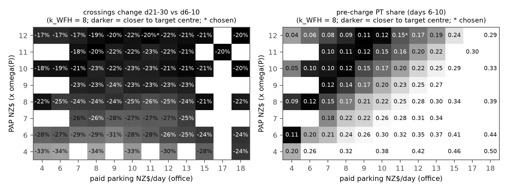
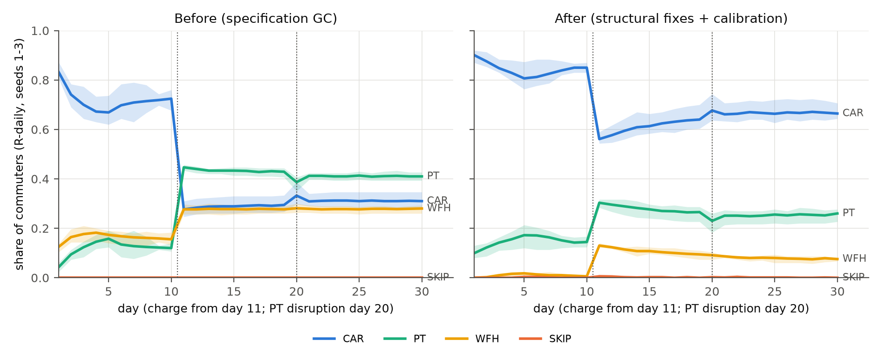
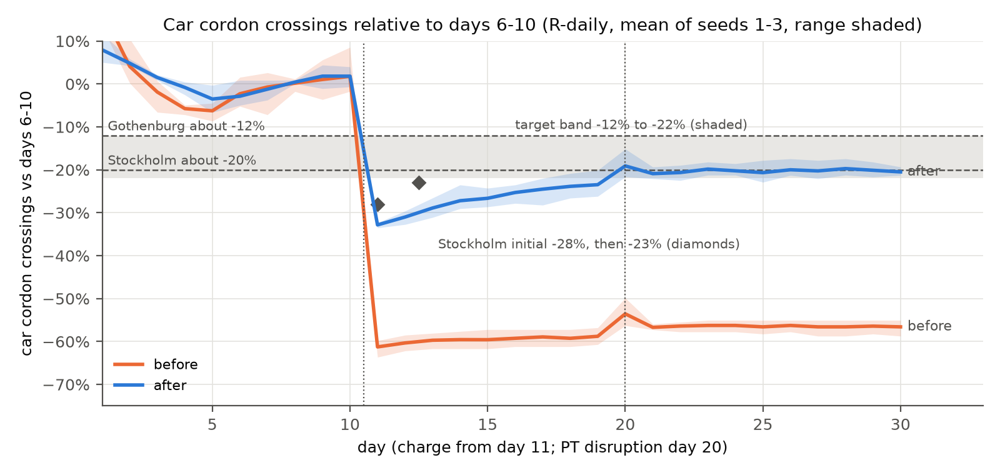

# Behaviour calibration report

Generated by `scripts/calibrate_behaviour.py` (data: `data/behaviour_calibration.json`). R-daily arm, rule decider, PyEngine, n = 300, 30 days, seeds 1-3 (held-out seeds 4-5 and, after the selection, unseen seeds 6-12 for checking only). The LLM arms are never calibrated. Capacity is recalibrated per seed and per evaluated point with `cordonlite.run.calibrate` (car-weighted peak 15-min queue delay of 15 min, days 6-10, no charge).

## Targets (all stated assumptions)

| Target | Band | Centre | Meaning |
|---|---|---|---|
| `base_car` | 0.75 to 0.85 | 0.8 | car share, mean of days 6-10 (pre-charge), R-daily |
| `base_pt` | 0.08 to 0.15 | 0.115 | PT share, days 6-10 |
| `base_wfh` | 0 to 0.1 | - | WFH share, days 6-10 (at most) |
| `base_skip` | 0 to 0.02 | - | SKIP share, days 6-10 (at most) |
| `change_21_30` | -0.22 to -0.12 | -0.2 | car cordon crossings, mean days 21-30 vs mean days 6-10 |
| `change_11_13` | -0.3 to 0 | - | overshoot, mean days 11-13 vs days 6-10 (may reach about -30%) |

Response anchors: Stockholm about -20% (an initial -28%, then -23%, settling at 20-22%), Gothenburg about -12% (Börjesson et al. 2012, Transport Policy 20:1-12; Börjesson and Kristoffersson 2015, TR-A 75:134-146). Single-seed tolerance: shares ±0.05, response ±4 pp.

**Comparability of the anchors.** The Stockholm and Gothenburg figures are reductions of total cordon-crossing traffic in charged hours (all vehicles and purposes), observed over months to years. v3 section 10.5 lists them as soft checks, notes that private-car elasticities (-0.85 to -1.9) are about twice the total-traffic ones (-0.4 to -0.9), and asks for the comparison to be reported as qualitative only. The target here is a hard band on AM car-commuter crossings over days 21-30, and days 11-13 stand in for Stockholm's early -28% then -23%. A private-car commuter response is likely larger than the total-traffic one, and the observed trajectory unfolded over months, not days. The band is therefore a stated assumption that puts the rule arm in a plausible range, not a validation. Auckland-specific support is indicative only: AT option 1a (v3 10.5) implies AM-peak vehicle trips of about -3,600 against about 19,000 charged vehicles (about 19%).

## Structural fixes (applied before the search)

- **memory.ref_fee_update**: all_days (EMA of the fee PAID, 0 on non-car days) -> faced (EMA, alpha = memory.ema_alpha, of the fee FACED at the car reference departure on every day). [v3 5.2 fee-ref, with two differences [A]: on car days the fee actually paid (after retiming) rather than the fee at h0, and alpha 0.3 (SPEC) rather than 0.2]. With the paid fee, agents who left the car kept a reference of 0 and a loss term on the full fee for ever, so the day-11 response could not fade.
- **traits.eta**: [0, 0.5, 1, 2, 3] -> [0, 0.25, 0.5, 0.75, 1]. [v3 4.4 capped variant; De Borger and Fosgerau 2008: a total weight of 4 is generous]. The loss term was larger than the fee itself for day-11 leavers.
- **costs.wfh_form**: spec (WFH = k_WFH x phi; saves car time and parking) -> v3_relative (WFH = k_WFH x phi + VoT/60 x free-flow time + parking + fuel). [v3 6.2: WFH has no PARK term; zero-fee property]. WFH no longer earns the commute, parking and fuel as savings; it still avoids congestion delay, schedule delay and the charge.
- **costs.fuel_cost_per_km**: 0 (no fuel cost; v3 folded fuel into its parking value) -> 0.23 NZ$/km, fixed from evidence [L]; car fuel = 2 x path_km x 0.23, 0 for company cars. Driving cost only time, schedule delay, charge and parking, so the calibrated parking value also stood for fuel. Fuel is now explicit and is not a calibration scalar.
- **clock.discontinuity_triggers**: [T1, T2, T4, T6] -> [T1, T4, T6]. [A, Verplanken et al. 2008]: habit discontinuity is a change of the performance context; a price change leaves route, time and cues intact, so kappa_H is no longer halved at the charge wake.
- **costs.pt_attitude_penalty**: 0 -> PAP x omega(P), searched in 4-12. [v3 6.2 PAP NZ$8, swept {4, 8, 12}, in v3's form omega(P) x PAP x HTA/2]; free scalar 1, entered in the specification form omega(P) x (VoT/60 x T_pt + PAP), so the value is not comparable with v3's.
- **engine capacity**: seed-1 scale used for every seed -> recalibrated per seed and per evaluated point; data/calibration.json holds by_seed records. Pre-charge congestion feeds back on the response.

## Fuel cost added

The car option now carries a fuel cost of 2 x path_km x NZ$0.23/km (round trip, to the cent; 0 for company cars and work vehicles, as for parking). The per-km value is fixed from evidence (regular petrol NZ$2.53/L, MBIE weekly fuel price monitoring, first week of September 2025, times 9.0 L/100 km real-world light petrol vehicle consumption, Metcalfe and Sridhar 2016 for the Ministry of Transport; sources in `config.toml`) and is not searched. Under `wfh_form = "v3_relative"` WFH carries the fuel cost as it carries parking, so WFH still earns no credit for the avoided drive. The prompt of the LLM arms states the daily fuel cost and lists it per option. Before this change driving cost time, schedule delay, charge and parking only, and v3 had treated fuel as folded into its parking value.

The search was rerun with the same targets, seeds, loss and selection rule, and with the paid-parking grid moved downward (coarse [4.0, 6.0, 8.0, 10.0, 12.0, 15.0, 18.0], refinement [7.0, 8.0, 9.0, 10.0, 11.0, 12.0, 13.0]; without fuel: coarse [8.0, 10.0, 12.0, 15.0, 18.0], refinement [14.0, 15.0, 16.0, 17.0, 18.0]). The log of the search without fuel is kept in `data/behaviour_calibration_pre_fuel.json` and its report in `docs/calibration_report_pre_fuel.md`.

| | Without fuel (previous) | With fuel (this report) |
|---|---|---|
| Fuel cost | none | NZ$0.23/km, fixed (mean about NZ$6.6 a day for a driver who pays it) |
| PAP (x omega(P)) | NZ$11 | NZ$12 (upper edge of the searched range) |
| Paid parking, office (student) | NZ$17 (NZ$12.75) | NZ$11 (NZ$8.25) |
| k_WFH (x phi(F)) | NZ$8 | NZ$8 |
| Feasible points | 2 of 127 (after rounding) | 0 of 178 |
| Car share d6-10 (0.75-0.85) | 0.853 | 0.835 |
| PT share d6-10 (0.08-0.15) | 0.137 | 0.154 |
| WFH share d6-10 (at most 0.10) | 0.009 | 0.009 |
| Crossings d11-13 vs d6-10 (to about -30%) | -29.4% | -30.9% |
| Crossings d21-30 vs d6-10 (-12% to -22%) | -20.9% | -20.3% |
| Capacity scale (mean of seeds 1-3) | 0.447 | 0.444 |

Paid parking falls from NZ$17 to NZ$11, by about the mean daily fuel cost of a driver who pays for fuel, so the money cost of driving for a typical paying commuter is about the same as before (parking plus fuel about NZ$18 against NZ$17). The fit is slightly worse on the overshoot: no grid point meets every band, and the lowest-loss point has an overshoot of -30.9% against the 'about -30%' bound (it would be feasible at a bound of -31%). Fuel rises with distance while parking does not, so long-distance drivers are closer to switching and the first response to the charge is a little stronger along the whole ridge. PAP moves from 11 to 12, the edge of the searched range. The previous values with fuel added and nothing else changed (PAP 11, parking 17) give base car 0.689 and PT 0.300, far outside the baseline bands, which is why the parking value had to fall.

## Search

178 grid points x 3 seeds = 534 evaluations, each with its own capacity calibration. Coarse grid: PAP [4.0, 6.0, 8.0, 10.0, 12.0], paid parking [4.0, 6.0, 8.0, 10.0, 12.0, 15.0, 18.0], k_WFH [2.0, 4.0, 6.0, 8.0] (NZ$). Refinement: PAP [6.0, 7.0, 8.0, 9.0, 10.0, 11.0, 12.0], parking [7.0, 8.0, 9.0, 10.0, 11.0, 12.0, 13.0], k_WFH [8.0]. Selection: lexicographic: (1) feasible = every 3-seed mean in its target band at the targets' stated precision (shares to 2 decimals, changes to whole percent) and every seed within the stated single-seed tolerance; (2) among feasible points, the smallest squared relative distance to the anchors (PAP 8 [v3], paid parking 17 [AT car-park all-day rate 2014], k_WFH 8 [v3]); (3) loss as tie-break. If no point is feasible, the lowest loss. Loss: Loss of one grid point over its seeds. centre: sum of squared (3-seed mean - centre) / scale for base car, base PT and the d21-30 response (scales 0.05, 0.035, 0.04); band: squared band excess of the 3-seed means for every target (scale 0.02), plus squared excess beyond the stated single-seed tolerance for each seed; prior: 0.02 x sum of squared relative distances of the scalars from the v3 values (8, 8, 8), a weak tie-break toward the design-note values.

0 of 178 points are feasible at the stated precision (shares to 2 decimals, changes to whole percent); strictly (unrounded 3-seed means) 0 are. With no feasible point the rule falls back to the lowest loss, which gives pap12_park11_wfh8. At the stated precision the chosen point misses `change_11_13` (-30.9%) and meets the other bands; base PT is in band only after rounding (0.154 -> 0.15).

Sensitivity to the soft overshoot bound ('may reach about -30%', treated as a hard bound): bound -30.0%: 0 feasible, chosen pap12_park11_wfh8; bound -31.0%: 1 feasible, chosen pap12_park11_wfh8; bound -32.0%: 1 feasible, chosen pap12_park11_wfh8; bound -33.0%: 3 feasible, chosen pap10_park9_wfh8. The chosen point is the only one that becomes feasible at -31%; a bound of -33% admits two points lower on the ridge and would move the choice to the one nearest the anchors. Sensitivity to the paid-parking anchor (same rule, anchor value changed): anchor NZ$8: pap12_park11_wfh8; anchor NZ$10: pap12_park11_wfh8; anchor NZ$12: pap12_park11_wfh8; anchor NZ$17: pap12_park11_wfh8. The anchors act only inside a feasible set, so with no feasible point they played no part in this choice.

Selection history (append-only from this version; `search.selection_history`): Earlier versions of the selection rule and anchors were overwritten by --stage select and are not recoverable from this log. What is known: the coarse grid (paid parking 8, 10, 12, 15, 18) was run first; the paid-parking anchor NZ$17 is not on it and entered with the refinement grid (parking 14-18 at k_WFH 8) along the PAP-parking ridge that the coarse grid had located, so the NZ$17 anchor was fixed after coarse-grid results had been seen. From this version on, --stage select appends the rule, anchors and choice it replaces to this list. 2026-10-03: fuel cost added to the car option (costs.fuel_cost_per_km, fixed from evidence, not searched) and the search rerun with the paid-parking grid moved downward. This replaces the search without fuel, which chose pap11_park17_wfh8 under the same rule and anchors; its full log is kept in data/behaviour_calibration_pre_fuel.json and its report in docs/calibration_report_pre_fuel.md.

Feasible points and the ten lowest-loss points (3-seed means):

| PAP | parking | k_WFH | feasible | anchor dist. | loss | base car | base PT | base WFH | d11-13 | d21-30 |
|---|---|---|---|---|---|---|---|---|---|---|
| 11 | 11 | 8 | no | 0.265 | 6.06 | 0.833 | 0.161 | 0.005 | -33.2% | -23.1% |
| 10 | 9 | 8 | no | 0.284 | 4.03 | 0.843 | 0.149 | 0.008 | -32.9% | -21.8% |
| 9 | 8 | 8 | no | 0.296 | 5.83 | 0.851 | 0.144 | 0.006 | -33.8% | -22.7% |
| 11 | 10 | 8 | no | 0.310 | 3.90 | 0.847 | 0.146 | 0.007 | -32.9% | -21.7% |
| 12 | 12 | 8 | no | 0.337 | 5.38 | 0.818 | 0.171 | 0.012 | -32.4% | -21.8% |
| 11 | 9 | 8 | no | 0.362 | 6.89 | 0.878 | 0.117 | 0.005 | -32.8% | -22.5% |
| 12 | 11 | 8 | no | 0.375 | 2.04 | 0.835 | 0.154 | 0.009 | -30.9% | -20.3% |
| 12 | 10 | 8 | no | 0.420 | 4.45 | 0.872 | 0.120 | 0.007 | -31.6% | -21.6% |
| 11 | 8 | 8 | no | 0.421 | 5.87 | 0.879 | 0.108 | 0.012 | -31.0% | -20.1% |
| 12 | 9 | 8 | no | 0.471 | 5.69 | 0.878 | 0.114 | 0.007 | -29.1% | -19.5% |

Chosen: **PAP NZ$12 x omega(P), paid parking NZ$11/day (student NZ$8.25), k_WFH NZ$8 x phi(F)**.

How to read the chosen values. PAP enters in the specification form omega(P) x (VoT/60 x T_pt + PAP) + fare: omega also scales PT time, and v3's HTA/2 factor is absent. v3 6.2 uses omega(P) x PAP x HTA/2 (HTA 1 local, 2 boundary) with PAP 8 swept {4, 8, 12}, so Cordon-Lite's 12 x omega equals v3 PAP 12 (boundary homes) to 24 (local homes) and is not comparable with v3's NZ$8; P = 1-2 agents also face doubled or 1.5 x PT time and practically never ride PT. PAP 12 is the upper edge of the searched range (4-12, the v3 sweep), so it is bounded by the grid rather than identified (edge check below). Paid parking NZ$11 is in effect fitted (x1.4 the v3 NZ$8, which v3 says also stands for fuel; v3 warns that parking above NZ$8 fails its zero-fee property for P = 5 local agents). It is parking alone: fuel is a separate, fixed cost of the car option (section 'Fuel cost added'). The AT 2014 casual all-day rate (NZ$17) remains the selection anchor but did not act, because no point was feasible. k_WFH = 8 is the v3 value at the edge of the searched range, so it is not identified by the calibration.

## Before vs after (3-seed means)

| Metric | Target | Before | Structural fixes only (v3 values) | After (chosen) |
|---|---|---|---|---|
| car share d6-10 | 0.75-0.85 | 0.713 | 0.818 | 0.835 |
| PT share d6-10 | 0.08-0.15 | 0.126 | 0.175 | 0.154 |
| WFH share d6-10 | 0-0.1 | 0.161 | 0.007 | 0.009 |
| SKIP share d6-10 | 0-0.02 | 0.000 | 0.000 | 0.001 |
| crossings d11-13 vs d6-10 | -30.0% to +0.0% | -60.4% | -36.6% | -30.9% |
| crossings d21-30 vs d6-10 | -22.0% to -12.0% | -56.5% | -24.5% | -20.3% |
| car share d21-30 | - | 0.311 | 0.618 | 0.666 |
| PT share d21-30 | - | 0.411 | 0.308 | 0.253 |
| WFH share d21-30 | - | 0.278 | 0.074 | 0.079 |
| 08:00-09:00 crossing share d21-30 | - | 0.268 | 0.372 | 0.377 |
| peak delay d6-10 (min) | - | 14.372 | 15.425 | 15.006 |
| peak delay d21-30 (min) | - | 1.641 | 2.491 | 2.825 |
| capacity scale | - | 0.365 | 0.425 | 0.444 |

'Before' is the pre-recalibration specification, which has no fuel cost. 'Structural fixes only' is the current model, fuel included, at the v3 scalars (PAP 8, parking 8, k_WFH 8). With fuel on top of the v3 parking value the v3-valued model has base car 0.818 and PT 0.175 (PT above its band) and responds by -24.5% on days 21-30 and -36.6% on days 11-13 (per seed -23.6%, -24.3%, -25.5%), both beyond their bands. Without fuel the same v3-valued model gave car 0.968, PT 0.019 and a response of -15.4% (overshoot -25.0%), inside both response bands. v3 treated its NZ$8 parking as including fuel, so adding fuel to it counts fuel twice; the fuel-free row is the like-for-like v3-valued sensitivity. In the search the scalars moved to restore the assumed baseline shares (PAP up to 12) and the response moved with them, from -24.5% to -20.3%. The match with Stockholm's -20% is partly a by-product of fitting the baseline.

## Per-seed metrics against each target (chosen values)

| Seed | capacity scale | base car | base PT | base WFH | base SKIP | d11-13 | d21-30 | within band / tolerance |
|---|---|---|---|---|---|---|---|---|
| 1 | 0.5078 | 0.876 | 0.119 | 0.005 | 0.000 | -29.6% | -18.3% | base_car within tol. |
| 2 | 0.4128 | 0.817 | 0.167 | 0.014 | 0.001 | -31.1% | -20.8% | base_pt within tol.; change_11_13 within tol. |
| 3 | 0.4128 | 0.813 | 0.177 | 0.009 | 0.001 | -32.0% | -21.7% | base_pt within tol.; change_11_13 within tol. |
| 4 (held out) | 0.4531 | 0.846 | 0.133 | 0.021 | 0.000 | -32.1% | -20.7% | change_11_13 within tol. |
| 5 (held out) | 0.4128 | 0.821 | 0.155 | 0.023 | 0.001 | -30.7% | -20.3% | base_pt within tol.; change_11_13 within tol. |

Target status on the calibration seeds 1-3:

- `base_car`: mean 0.835 (in band); seeds in band 2/3, within tolerance 3/3.
- `base_pt`: mean 0.154 (OUT of band); seeds in band 1/3, within tolerance 3/3.
- `base_wfh`: mean 0.009 (in band); seeds in band 3/3, within tolerance 3/3.
- `base_skip`: mean 0.001 (in band); seeds in band 3/3, within tolerance 3/3.
- `change_21_30`: mean -0.203 (in band); seeds in band 3/3, within tolerance 3/3.
- `change_11_13`: mean -0.309 (OUT of band); seeds in band 1/3, within tolerance 3/3.

## Out-of-sample seeds and the ridge alternatives

Out-of-sample checks run after the selection; they did not influence it. Capacity is recalibrated per seed as in the search. Seeds 4-5 come from the final stage; seeds 6-12 were never run before the selection.

| Seed | capacity scale | base car | base PT | base WFH | d11-13 | d21-30 | outside band / tolerance |
|---|---|---|---|---|---|---|---|
| 4 | 0.4531 | 0.846 | 0.133 | 0.021 | -32.1% | -20.7% | change_11_13 within tol. |
| 5 | 0.4128 | 0.821 | 0.155 | 0.023 | -30.7% | -20.3% | base_pt within tol.; change_11_13 within tol. |
| 6 | 0.4303 | 0.850 | 0.124 | 0.025 | -26.4% | -11.7% | change_21_30 within tol. |
| 7 | 0.4674 | 0.839 | 0.159 | 0.002 | -31.5% | -20.5% | base_pt within tol.; change_11_13 within tol. |
| 8 | 0.3961 | 0.799 | 0.191 | 0.010 | -30.2% | -18.9% | base_pt within tol.; change_11_13 within tol. |
| 9 | 0.4674 | 0.826 | 0.145 | 0.028 | -30.7% | -18.1% | change_11_13 within tol. |
| 10 | 0.4674 | 0.871 | 0.129 | 0.000 | -30.4% | -21.8% | base_car within tol.; change_11_13 within tol. |
| 11 | 0.4303 | 0.815 | 0.167 | 0.015 | -30.8% | -20.9% | base_pt within tol.; change_11_13 within tol. |
| 12 | 0.4485 | 0.876 | 0.109 | 0.014 | -39.9% | -30.1% | base_car within tol.; change_21_30 OUT of tol.; change_11_13 OUT of tol. |

| Point | seeds | base car | base PT | d11-13 | d21-30 |
|---|---|---|---|---|---|
| chosen PAP 12 / parking 11 | 1-3 (calibration) | 0.835 | 0.154 | -30.9% | -20.3% |
| chosen PAP 12 / parking 11 | 4-12 | 0.838 | 0.146 | -31.4% | -20.3% |
| chosen PAP 12 / parking 11 | 6-12 (unseen) | 0.839 | 0.146 | -31.4% | -20.3% |
| chosen PAP 12 / parking 11 | 1-12 | 0.837 | 0.148 | -31.3% | -20.3% |
| PAP 10 / parking 9 | 1-3 (calibration) | 0.843 | 0.149 | -32.9% | -21.8% |
| PAP 10 / parking 9 | 4-12 | 0.835 | 0.147 | -33.4% | -21.5% |
| PAP 11 / parking 10 | 1-3 (calibration) | 0.847 | 0.146 | -32.9% | -21.7% |
| PAP 11 / parking 10 | 4-12 | 0.847 | 0.140 | -32.7% | -21.8% |

The mean response generalises: -20.3% on unseen seeds 6-12 (-20.3% over seeds 1-12), with an overshoot of -31.4% (-31.3% over seeds 1-12), about 1 pp beyond the 'about -30%' bound as on the calibration seeds. Base car is 0.837 and base PT 0.148 over seeds 1-12, both in band. Single seeds vary more than the stated tolerance allows: seed 12 `change_21_30` -30.1%; seed 12 `change_11_13` -39.9%. The ridge alternatives (PAP 10 / parking 9, PAP 11 / parking 10) respond more strongly on seeds 4-12 (-21.5%, overshoot -33.4%, -21.8%, overshoot -32.7%) than the chosen point (-20.3%, -31.4%). The choice was not changed after seeing these seeds.

## PAP edge check (not part of the selection)

Run after the selection and not eligible for it: PAP values above the searched range 4-12 (the v3 sweep), logged because the chosen PAP is on the upper edge of the grid. Same seeds 1-3 and nested capacity calibration; k_WFH 8.

| PAP | parking | feasible | loss | base car | base PT | base WFH | d11-13 | d21-30 |
|---|---|---|---|---|---|---|---|---|
| 13 | 9 | no | 7.72 | 0.885 | 0.100 | 0.014 | -28.6% | -18.0% |
| 13 | 10 | no | 2.96 | 0.867 | 0.119 | 0.012 | -28.2% | -18.6% |
| 13 | 11 | no | 2.01 | 0.861 | 0.130 | 0.008 | -30.1% | -20.1% |
| 13 | 12 | no | 1.91 | 0.840 | 0.151 | 0.007 | -30.8% | -20.8% |
| 13 | 13 | no | 4.39 | 0.814 | 0.171 | 0.013 | -31.4% | -21.2% |
| 13 | 14 | no | 10.64 | 0.797 | 0.190 | 0.010 | -30.5% | -20.7% |
| 14 | 9 | no | 13.75 | 0.901 | 0.088 | 0.010 | -27.8% | -17.1% |
| 14 | 10 | no | 6.74 | 0.882 | 0.106 | 0.010 | -28.4% | -17.3% |
| 14 | 11 | no | 2.98 | 0.867 | 0.119 | 0.012 | -28.9% | -18.6% |
| 14 | 12 | yes | 1.50 | 0.850 | 0.138 | 0.010 | -28.5% | -19.3% |
| 14 | 13 | no | 1.94 | 0.839 | 0.152 | 0.008 | -30.8% | -20.5% |
| 14 | 14 | no | 3.71 | 0.815 | 0.170 | 0.012 | -30.4% | -20.9% |

Beyond the searched range PAP 14 / parking 12 would meet every band at the stated precision. These points were run after the selection and are not adopted: the PAP range 4-12 is the v3 sweep and the method was kept unchanged. They show that the ridge continues upward (higher PAP with higher parking), with a slightly smaller overshoot, so the chosen PAP is bounded by the grid. Extending the PAP range is the authors' decision.

## Retiming

Measured against a no-charge run at the same capacity and seed (days 21-30), because the no-charge run has the same day-to-day churn and congestion feedback.

| Seed | 08:00-09:00 share, charge | same, no charge | 07:00-08:00 share, charge | same, no charge |
|---|---|---|---|---|
| 1 | 0.415 | 0.425 | 0.392 | 0.356 |
| 2 | 0.385 | 0.362 | 0.373 | 0.354 |
| 3 | 0.331 | 0.399 | 0.458 | 0.362 |

08:00-09:00 crossing share under the charge minus no charge: -0.010, +0.022, -0.068 (seeds 1-3); 07:00-08:00: +0.035, +0.019, +0.095. Peak spreading is NOT visible in every seed.

Crossings per day before 07:30 (NZ$4 or less): seed 1: 55.1 with the charge vs 55.4 without, seed 2: 52.4 with the charge vs 63.4 without, seed 3: 56.4 with the charge vs 60.2 without.

- Crossings per day 06:00-07:30 (NZ$4 or less), days 21-30, mean of seeds 1-3: 54.6 with the charge, 59.7 without (-8%).
- Crossings per day 08:00-09:00 (NZ$6), days 21-30, mean of seeds 1-3: 75.6 with the charge, 100.4 without (-25%).
- Crossings per day 09:30-10:15 (back to NZ$4), days 21-30, mean of seeds 1-3: 10.0 with the charge, 8.2 without (+21%).

Paired check (common random numbers: the charged and no-charge runs share every rule noise draw): among agents who drive at days 26-30 in both runs (n = 527, seeds 1-3), 36.1% [32.1%, 40.2%] have a different modal departure with the charge (11.8% earlier, 24.3% later; mean shift +4.8 min). By F level: F1 0.33 [0.23, 0.46] n=63; F2 0.30 [0.22, 0.39] n=101; F3 0.35 [0.29, 0.41] n=236; F4 0.47 [0.37, 0.58] n=85; F5 0.40 [0.27, 0.56] n=42.

## Trait monotonicity

### Who adapts on the calibrated runs

Day-10 drivers (modal option days 6-10 a car option, twins and company cars excluded), pooled over seeds 1-3, share with 95% Wilson interval; in brackets the same share in the no-charge counterfactual (churn and selection baseline).

- **H -> drives on day 11** (not monotone): L1 0.53 [0.36, 0.70] n=30 (1.00) | L2 0.77 [0.64, 0.87] n=53 (1.00) | L3 0.50 [0.42, 0.59] n=139 (0.98) | L4 0.62 [0.55, 0.68] n=194 (0.99) | L5 0.71 [0.63, 0.77] n=156 (0.99)
- **H -> car user d26-30** (not monotone): L1 0.80 [0.63, 0.90] n=30 (0.97) | L2 0.89 [0.77, 0.95] n=53 (1.00) | L3 0.70 [0.62, 0.77] n=139 (0.95) | L4 0.76 [0.70, 0.82] n=194 (0.96) | L5 0.74 [0.66, 0.80] n=156 (0.99)
- **P -> PT user d26-30 (PT-feasible day-10 drivers)** (monotone up): L1 0.00 [0.00, 0.06] n=60 (0.00) | L2 0.01 [0.00, 0.05] n=138 (0.00) | L3 0.23 [0.18, 0.29] n=216 (0.02) | L4 0.28 [0.19, 0.38] n=87 (0.05) | L5 0.28 [0.15, 0.46] n=29 (0.07)
- **P -> PT user d26-30 (all PT-feasible agents)** (monotone up): L1 0.00 [0.00, 0.06] n=64 (0.00) | L2 0.01 [0.00, 0.05] n=146 (0.01) | L3 0.28 [0.23, 0.34] n=261 (0.09) | L4 0.53 [0.45, 0.61] n=155 (0.38) | L5 0.64 [0.52, 0.75] n=67 (0.55)
- **F -> retimed d26-30 (car keepers)** (monotone up): L1 0.31 [0.20, 0.45] n=48 (0.42) | L2 0.33 [0.24, 0.43] n=88 (0.34) | L3 0.41 [0.34, 0.48] n=197 (0.42) | L4 0.49 [0.37, 0.60] n=68 (0.41) | L5 0.53 [0.36, 0.70] n=30 (0.57)
- **S -> drives on day 11** (monotone down): L1 0.87 [0.76, 0.94] n=55 (0.98) | L2 0.73 [0.64, 0.80] n=114 (0.98) | L3 0.59 [0.53, 0.66] n=237 (0.99) | L4 0.52 [0.43, 0.61] n=113 (0.99) | L5 0.49 [0.36, 0.62] n=53 (1.00)
- **S -> car user d26-30** (not monotone): L1 0.82 [0.70, 0.90] n=55 (1.00) | L2 0.78 [0.70, 0.85] n=114 (0.99) | L3 0.75 [0.69, 0.80] n=237 (0.97) | L4 0.72 [0.63, 0.79] n=113 (0.96) | L5 0.74 [0.60, 0.84] n=53 (0.94)

### Population trait manipulation (unbiased check)

Every agent set to one level (1-5) of one trait (others drawn as usual), capacity fixed at the chosen point's per-seed scale, mean of seeds 1-3. Retiming and peak-band shares are differences from the no-charge run at the same setting.

| Trait | Level | d11-13 | d21-30 | PT share d6-10 | PT share d21-30 minus no-charge | day-10 drivers to PT | 08-09 share minus no-charge | retimed keepers minus no-charge |
|---|---|---|---|---|---|---|---|---|
| H | 1 | -33.8% | -18.6% | 0.152 | +0.101 | 0.117 | +0.031 | -0.044 |
| H | 2 | -32.6% | -18.1% | 0.160 | +0.098 | 0.121 | +0.049 | -0.025 |
| H | 3 | -34.7% | -18.7% | 0.158 | +0.101 | 0.124 | +0.043 | -0.052 |
| H | 4 | -29.1% | -19.5% | 0.165 | +0.113 | 0.113 | -0.037 | +0.035 |
| H | 5 | -24.2% | -21.0% | 0.164 | +0.126 | 0.122 | -0.075 | +0.012 |
| F | 1 | -20.5% | -10.1% | 0.185 | +0.093 | 0.113 | +0.045 | -0.007 |
| F | 2 | -22.3% | -12.0% | 0.167 | +0.107 | 0.123 | +0.015 | +0.034 |
| F | 3 | -29.8% | -14.2% | 0.167 | +0.114 | 0.116 | +0.002 | -0.008 |
| F | 4 | -39.1% | -32.2% | 0.150 | +0.108 | 0.124 | -0.085 | +0.005 |
| F | 5 | -42.2% | -37.9% | 0.134 | +0.107 | 0.117 | -0.104 | +0.022 |
| P | 1 | -16.0% | -4.0% | 0.001 | -0.000 | 0.000 | +0.051 | -0.001 |
| P | 2 | -16.1% | -4.2% | 0.032 | -0.002 | 0.005 | +0.052 | +0.027 |
| P | 3 | -38.6% | -25.4% | 0.116 | +0.168 | 0.172 | -0.024 | -0.002 |
| P | 4 | -42.1% | -33.0% | 0.294 | +0.184 | 0.255 | -0.094 | +0.075 |
| P | 5 | -44.8% | -36.8% | 0.397 | +0.185 | 0.312 | -0.129 | -0.005 |
| S | 1 | -19.3% | -17.8% | 0.154 | +0.101 | 0.115 | +0.006 | -0.042 |
| S | 2 | -24.7% | -18.9% | 0.154 | +0.106 | 0.121 | -0.007 | -0.033 |
| S | 3 | -31.2% | -20.7% | 0.154 | +0.112 | 0.129 | -0.011 | -0.012 |
| S | 4 | -36.5% | -22.3% | 0.154 | +0.115 | 0.132 | -0.034 | -0.005 |
| S | 5 | -41.4% | -23.4% | 0.154 | +0.120 | 0.137 | -0.039 | +0.003 |

- H, day 11-13 response (levels 1-5): -33.8%, -32.6%, -34.7%, -29.1%, -24.2%; linear trend +2.26 pp per level: NOT strictly monotone
- H, day 21-30 response: -18.6%, -18.1%, -18.7%, -19.5%, -21.0%; trend -0.64 pp per level: NOT monotone (habit re-forms on the new mode at once, so high H also keeps leavers on PT)
- P, PT share at days 21-30 caused by the charge (charge minus no-charge run): -0.000, -0.002, +0.168, +0.184, +0.185: NOT monotone
- P, PT share at days 21-30 with the charge: 0.000, 0.011, 0.263, 0.473, 0.581: rises with P (monotone)
- P, share of day-10 drivers on PT at days 26-30: 0.000, 0.005, 0.172, 0.255, 0.312 (selection: at P = 5 most PT-feasible agents already ride PT before the charge, so the remaining drivers are those for whom PT is poor)
- F, 08:00-09:00 share minus no-charge: +0.045, +0.015, +0.002, -0.085, -0.104: more peak spreading with higher F (monotone)
- F, retimed keepers minus no-charge: -0.007, +0.034, -0.008, +0.005, +0.022: NOT strictly monotone (trend +0.003 per level)
- S, day 21-30 response: -17.8%, -18.9%, -20.7%, -22.3%, -23.4%: stronger with higher S (monotone)
- S, day 11-13 response: -19.3%, -24.7%, -31.2%, -36.5%, -41.4%: stronger with higher S (monotone)

### Where the F gradient comes from

Same population manipulation (every agent at one F level, capacity fixed, seeds 1-3), split by margin. Differences are charge minus no-charge run at the same setting, days 21-30.

| F | d21-30 | car share | PT share | WFH share | WFH share with charge (seeds 1-3) | retimed keepers, charge | same, no charge |
|---|---|---|---|---|---|---|---|
| 1 | -10.1% | -0.093 | +0.093 | -0.002 | 0.000, 0.000, 0.000 | 0.352 | 0.359 |
| 2 | -12.0% | -0.103 | +0.107 | -0.006 | 0.000, 0.000, 0.000 | 0.407 | 0.372 |
| 3 | -14.2% | -0.147 | +0.114 | +0.032 | 0.048, 0.031, 0.042 | 0.451 | 0.459 |
| 4 | -32.2% | -0.287 | +0.108 | +0.178 | 0.202, 0.166, 0.210 | 0.501 | 0.496 |
| 5 | -37.9% | -0.337 | +0.107 | +0.229 | 0.241, 0.236, 0.267 | 0.523 | 0.501 |

The F response gradient comes mainly from F = 4-5 hybrid workers switching to daily WFH, which is unbounded without v3's WFH quota; PT gains barely vary with F. Retiming of car keepers against the no-charge run is flat across F (the paired departure change rises with F, 0.33 to 0.40, but retiming in the no-charge run rises with F too). The F response gradient is therefore not evidence for the 'high F retimes more' target.

## Limits

- The targets are stated assumptions, and the response anchors are not like-for-like: Stockholm and Gothenburg measured total cordon traffic in charged hours over months to years, while the band here applies to AM car commuters over days 21-30. v3 10.5 asks for a qualitative comparison only; the private-car commuter response is likely larger than the total-traffic one.
- With the fuel cost fixed, no grid point meets every band, even after rounding to the stated precision. The chosen point is the lowest-loss point (the rule's fallback). It misses the soft overshoot bound by about 1 pp (-30.9% against 'about -30%'; -31.3% over seeds 1-12) and has base PT at the top of its band (0.154, in band only after rounding; 0.148 over seeds 1-12). Base car (0.835) and the days 21-30 response (-20.3%) are in band.
- PAP 12 is the upper edge of the searched range (4-12, the v3 sweep), so PAP is bounded by the grid, not identified. An edge check run after the selection shows the ridge continuing upward: PAP 14 / parking 12 would meet every band at the stated precision (overshoot -28.5%). It was not adopted, because the method and the searched range were kept as before the fuel addition.
- Fuel is fixed, not fitted, but its value carries its own uncertainty: NZ$0.23/km uses the September 2025 petrol price (NZ$2.53/L) and 9.0 L/100 km. The same MBIE series gives NZ$2.97/L in September 2026 (NZ$0.27/km), and newer or hybrid vehicles use less fuel. Paid parking would move by roughly the change in mean daily fuel cost (about NZ$1 for NZ$0.04/km). Every non-company driver pays petrol at the same rate; electric vehicles, employer fuel cards and other running costs (tyres, maintenance) are not represented.
- The v3-valued model is no longer inside the response bands once fuel is added on top of v3's NZ$8 parking (-24.5%, overshoot -36.6%, base PT 0.175), because v3 meant that parking value to include fuel. Without fuel the v3-valued model gave -15.4% (overshoot -25.0%) and failed only the assumed baseline shares. The scalars were moved to meet the baseline, and the response moved with them to about -20%.
- A realistic hybrid-work baseline is not reproduced: k_WFH = 4 gives about 6% WFH before the charge, but then the charge moves hybrid workers who are near indifference to WFH every day and the response reaches about -33%. v3's WFH quota (1-3 days per 5-day block) would bound this margin; it is not implemented because a rolling or block quota synchronises WFH days across agents (all start on day 1) and needs staggered office days. k_WFH stays at the v3 value 8, the edge of the searched range (not identified).
- PAP and paid parking are nearly collinear for the baseline (both move PT against car); along the ridge the response varies between about -20% and -25% and the overshoot between about -29% and -37%, and both weaken as PAP rises. Paid parking NZ$11 is in effect fitted (x1.4 v3's NZ$8, above v3's zero-fee limit). It is now parking alone, below the AT 2014 casual all-day rate of NZ$17 that serves as the selection anchor; the anchor did not act because no point was feasible. PAP enters in the specification form (omega also scales PT time; no HTA/2), so PAP 12 equals v3 PAP 12-24.
- The choice does not depend on the anchors or, up to -32%, on the soft overshoot bound (the chosen point is the only feasible one at -31% and -32%). At -33% two points lower on the ridge become feasible and PAP 10 / parking 9 would be chosen; out of sample (seeds 4-12) it responds more strongly (-21.5%, overshoot -33.4%) than the chosen point (-20.3%, -31.4%).
- Capacity is a fourth calibrated quantity, recalibrated per point and seed; its discrete jumps (for example 0.43 vs 0.413 between neighbouring points) add noise of a few points to the base shares.
- Unseen seeds 6-12 give a response of -20.3% (mean), but single seeds vary widely: seed 6 -11.7% (just outside the band, within tolerance) and seed 12 -30.1% with an overshoot of -39.9%, both outside the stated tolerance.
- Retiming is weak, as in the literature (Karlström and Franklin 2009): the 08:00-09:00 share of crossings falls by 1.0-6.8 points against the no-charge run in two of three seeds and not in seed 2, and part of the paired departure change is later departures enabled by the congestion relief. At single-agent level, retiming on the charge morning needs H = 1 under the defaults. The F response gradient comes mainly from daily WFH of F = 4-5 hybrid workers (no quota); retiming of car keepers is flat across F.
- The v3 worked example (identical A, different B: pay / PT / retime) separates only with the v3 settings (PAP 4 = v3 PAP 8 x HTA/2 for a local home, T2 a habit discontinuity). Under the calibrated defaults the example's free-parking agent, with the fuel cost of its 20 km path (NZ$9.20), keeps the car at its usual time for 449 of the 625 trait combinations, switches to PT for 170 and retimes for 6 (H = 1 only); the v3 retimer persona (H = 2) does not retime. With paid parking NZ$11 and fuel a pay / PT / retime split remains (tests/test_rules.py).
- H damps the charge wake only from level 4 upwards (overshoot -33.8%, -32.6%, -34.7% at H = 1-3, -29.1% at H = 4, -24.2% at H = 5; kappa_H is 0-1 NZ$ at H = 1-3), and not in the long run: habit re-forms on the new mode immediately, so high H also keeps leavers on PT.
- The charge-induced switch to PT is flat from P = 3 upwards (+0.17 to +0.19 against the no-charge run): at P = 5 most agents for whom PT is viable already ride PT before the charge (ceiling), and the remaining P = 5 drivers have free parking or long PT trips. The PT share after the charge rises with P (0.00, 0.01, 0.26, 0.47, 0.58).
- Who-adapts tables conditional on being a day-10 driver are biased by selection (for example H = 2 drivers keep the car more often than H = 4-5 drivers because low-H drivers drive only when the car is clearly best); the population manipulation is the unbiased check.
- The reference fee follows the fee faced, but on car days it uses the fee actually paid (after retiming; v3 uses the fee at h0 before retiming) and alpha 0.3 (SPEC; v3 0.2), so a retimer keeps a loss term on returning to the peak.
- Clock arms keep the day-11 overshoot because no trigger fires after day 12 (v3 7.1 by design; T7 off), so the R-clock response stays stronger than R-daily. The LLM deciders are not calibrated, but the shared Layer A inputs set here (parking NZ$11) and the fixed fuel cost reach the LLM prompt. The rule's WFH earns no parking, fuel or commute credit while the prompt states the daily parking and fuel costs, so live-LLM WFH shares are not comparable with the rule arm on this margin. MockLLM re-weights the same GC parts and responds more strongly.

