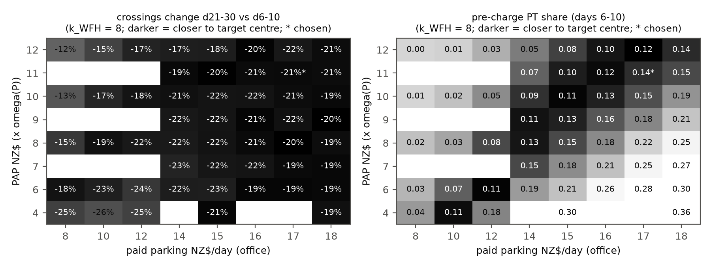
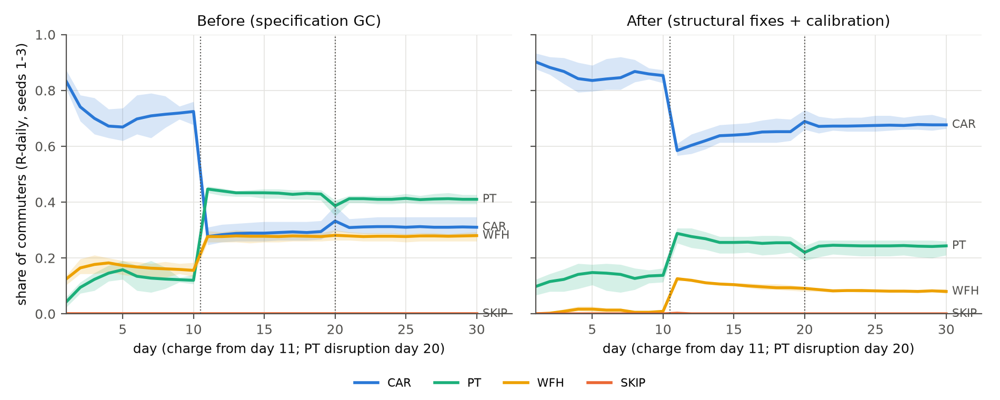
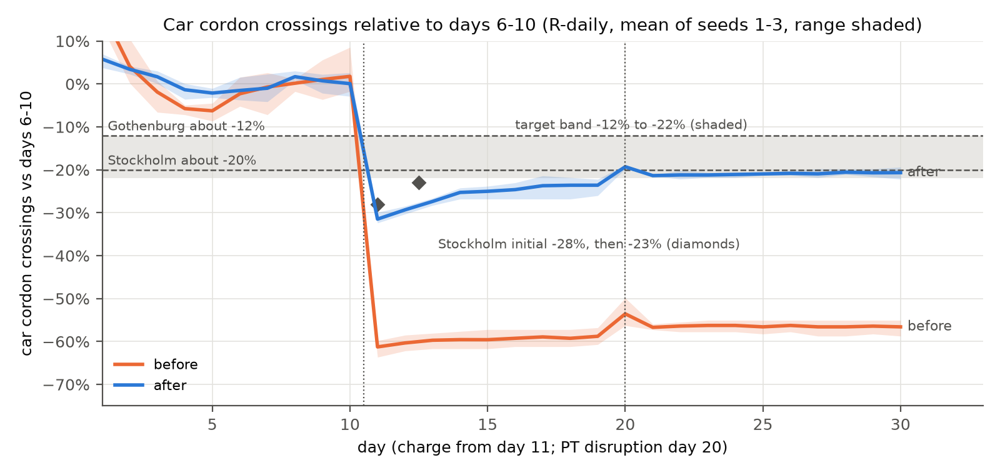

# Behaviour calibration report

Generated by `scripts/calibrate_behaviour.py` (data: `data/behaviour_calibration.json`). R-daily arm, rule decider, PyEngine, n = 300, 30 days, seeds 1-3 (held-out seeds 4-5 and, after the selection, unseen seeds 6-12 for checking only). The LLM arms are never calibrated. Capacity is recalibrated per seed and per evaluated point with `cordonlite.run.calibrate` (car-weighted peak 15-min queue delay of 15 min, days 6-10, no charge).

## Targets (all stated assumptions)

| Target | Band | Centre | Meaning |
|---|---|---|---|
| `base_car` | 0.75 to 0.85 | 0.8 | car share, mean of days 6-10 (pre-charge), R-daily |
| `base_pt` | 0.08 to 0.15 | 0.115 | PT share, days 6-10 |
| `base_wfh` | 0 to 0.1 | - | WFH share, days 6-10 (at most) |
| `base_skip` | 0 to 0.02 | - | SKIP share, days 6-10 (at most) |
| `change_21_30` | -0.22 to -0.12 | -0.2 | car cordon crossings, mean days 21-30 vs mean days 6-10 |
| `change_11_13` | -0.3 to 0 | - | overshoot, mean days 11-13 vs days 6-10 (may reach about -30%) |

Response anchors: Stockholm about -20% (an initial -28%, then -23%, settling at 20-22%), Gothenburg about -12% (Börjesson et al. 2012, Transport Policy 20:1-12; Börjesson and Kristoffersson 2015, TR-A 75:134-146). Single-seed tolerance: shares ±0.05, response ±4 pp.

**Comparability of the anchors.** The Stockholm and Gothenburg figures are reductions of total cordon-crossing traffic in charged hours (all vehicles and purposes), observed over months to years. v3 section 10.5 lists them as soft checks, notes that private-car elasticities (-0.85 to -1.9) are about twice the total-traffic ones (-0.4 to -0.9), and asks for the comparison to be reported as qualitative only. The target here is a hard band on AM car-commuter crossings over days 21-30, and days 11-13 stand in for Stockholm's early -28% then -23%. A private-car commuter response is likely larger than the total-traffic one, and the observed trajectory unfolded over months, not days. The band is therefore a stated assumption that puts the rule arm in a plausible range, not a validation. Auckland-specific support is indicative only: AT option 1a (v3 10.5) implies AM-peak vehicle trips of about -3,600 against about 19,000 charged vehicles (about 19%).

## Structural fixes (applied before the search)

- **memory.ref_fee_update**: all_days (EMA of the fee PAID, 0 on non-car days) -> faced (EMA, alpha = memory.ema_alpha, of the fee FACED at the car reference departure on every day). [v3 5.2 fee-ref, with two differences [A]: on car days the fee actually paid (after retiming) rather than the fee at h0, and alpha 0.3 (SPEC) rather than 0.2]. With the paid fee, agents who left the car kept a reference of 0 and a loss term on the full fee for ever, so the day-11 response could not fade.
- **traits.eta**: [0, 0.5, 1, 2, 3] -> [0, 0.25, 0.5, 0.75, 1]. [v3 4.4 capped variant; De Borger and Fosgerau 2008: a total weight of 4 is generous]. The loss term was larger than the fee itself for day-11 leavers.
- **costs.wfh_form**: spec (WFH = k_WFH x phi; saves car time and parking) -> v3_relative (WFH = k_WFH x phi + VoT/60 x free-flow time + parking). [v3 6.2: WFH has no PARK term; zero-fee property]. WFH no longer earns the commute and parking as savings; it still avoids congestion delay, schedule delay and the charge.
- **clock.discontinuity_triggers**: [T1, T2, T4, T6] -> [T1, T4, T6]. [A, Verplanken et al. 2008]: habit discontinuity is a change of the performance context; a price change leaves route, time and cues intact, so kappa_H is no longer halved at the charge wake.
- **costs.pt_attitude_penalty**: 0 -> PAP x omega(P), searched in 4-12. [v3 6.2 PAP NZ$8, swept {4, 8, 12}, in v3's form omega(P) x PAP x HTA/2]; free scalar 1, entered in the specification form omega(P) x (VoT/60 x T_pt + PAP), so the value is not comparable with v3's.
- **engine capacity**: seed-1 scale used for every seed -> recalibrated per seed and per evaluated point; data/calibration.json holds by_seed records. Pre-charge congestion feeds back on the response.

## Search

127 grid points x 3 seeds = 381 evaluations, each with its own capacity calibration. Coarse grid: PAP [4.0, 6.0, 8.0, 10.0, 12.0], paid parking [8.0, 10.0, 12.0, 15.0, 18.0], k_WFH [2.0, 4.0, 6.0, 8.0] (NZ$). Refinement: PAP [6.0, 7.0, 8.0, 9.0, 10.0, 11.0, 12.0], parking [14.0, 15.0, 16.0, 17.0, 18.0], k_WFH [8.0]. Selection: lexicographic: (1) feasible = every 3-seed mean in its target band at the targets' stated precision (shares to 2 decimals, changes to whole percent) and every seed within the stated single-seed tolerance; (2) among feasible points, the smallest squared relative distance to the anchors (PAP 8 [v3], paid parking 17 [AT car-park all-day rate 2014], k_WFH 8 [v3]); (3) loss as tie-break. If no point is feasible, the lowest loss. Loss: Loss of one grid point over its seeds. centre: sum of squared (3-seed mean - centre) / scale for base car, base PT and the d21-30 response (scales 0.05, 0.035, 0.04); band: squared band excess of the 3-seed means for every target (scale 0.02), plus squared excess beyond the stated single-seed tolerance for each seed; prior: 0.02 x sum of squared relative distances of the scalars from the v3 values (8, 8, 8), a weak tie-break toward the design-note values.

2 of 127 points are feasible at the stated precision. Strictly (unrounded 3-seed means), 0 points meet every band: feasibility depends on rounding (base car 0.853 -> 0.85, overshoot -30.2% -> -30%). The chosen point is also the lowest-loss point (pap11_park17_wfh8), so the choice does not depend on the rounding, but '2 feasible points' overstates the fit.

Sensitivity to the soft overshoot bound ('may reach about -30%', treated as a hard bound): bound -30.0%: 2 feasible, chosen pap11_park17_wfh8; bound -31.0%: 4 feasible, chosen pap8_park15_wfh8; bound -32.0%: 4 feasible, chosen pap8_park15_wfh8; bound -33.0%: 4 feasible, chosen pap8_park15_wfh8. A bound of -31% already moves the choice to PAP 8 / parking 15, which keeps the v3 PAP and meets the base car and PT bands strictly; it misses only the 'about -30%' overshoot, by about 1 pp. Out-of-sample seeds (section below), not the bound, are the reason to keep PAP 11.

Selection history (append-only from this version; `search.selection_history`): Earlier versions of the selection rule and anchors were overwritten by --stage select and are not recoverable from this log. What is known: the coarse grid (paid parking 8, 10, 12, 15, 18) was run first; the paid-parking anchor NZ$17 is not on it and entered with the refinement grid (parking 14-18 at k_WFH 8) along the PAP-parking ridge that the coarse grid had located, so the NZ$17 anchor was fixed after coarse-grid results had been seen. From this version on, --stage select appends the rule, anchors and choice it replaces to this list.

Feasible points and the ten lowest-loss points (3-seed means):

| PAP | parking | k_WFH | feasible | anchor dist. | loss | base car | base PT | base WFH | d11-13 | d21-30 |
|---|---|---|---|---|---|---|---|---|---|---|
| 11 | 17 | 8 | yes | 0.141 | 1.66 | 0.853 | 0.137 | 0.009 | -29.4% | -20.9% |
| 11 | 18 | 8 | yes | 0.144 | 1.82 | 0.842 | 0.150 | 0.008 | -30.2% | -21.1% |
| 8 | 15 | 8 | no | 0.014 | 2.19 | 0.841 | 0.150 | 0.010 | -31.2% | -21.7% |
| 9 | 16 | 8 | no | 0.019 | 2.19 | 0.837 | 0.155 | 0.008 | -30.9% | -20.5% |
| 9 | 15 | 8 | no | 0.029 | 2.65 | 0.860 | 0.132 | 0.007 | -30.9% | -21.8% |
| 7 | 14 | 8 | no | 0.047 | 2.88 | 0.843 | 0.149 | 0.008 | -31.2% | -23.1% |
| 10 | 17 | 8 | no | 0.062 | 1.96 | 0.840 | 0.152 | 0.008 | -30.6% | -21.1% |
| 10 | 16 | 8 | no | 0.066 | 2.53 | 0.861 | 0.132 | 0.007 | -31.0% | -21.7% |
| 11 | 16 | 8 | no | 0.144 | 3.29 | 0.870 | 0.120 | 0.010 | -28.3% | -21.0% |
| 12 | 18 | 8 | no | 0.253 | 1.82 | 0.856 | 0.136 | 0.008 | -29.2% | -21.1% |

Chosen: **PAP NZ$11 x omega(P), paid parking NZ$17/day (student NZ$12.75), k_WFH NZ$8 x phi(F)**.

How to read the chosen values. PAP enters in the specification form omega(P) x (VoT/60 x T_pt + PAP) + fare: omega also scales PT time, and v3's HTA/2 factor is absent. v3 6.2 uses omega(P) x PAP x HTA/2 (HTA 1 local, 2 boundary) with PAP 8 swept {4, 8, 12}, so Cordon-Lite's 11 x omega equals v3 PAP 11 (boundary homes) to 22 (local homes) and is not comparable with v3's NZ$8; P = 1-2 agents also face doubled or 1.5 x PT time and practically never ride PT. Paid parking NZ$17 is in effect fitted (x2.1 the v3 NZ$8; v3 warns that parking above NZ$8 fails its zero-fee property for P = 5 local agents); the AT 2014 casual all-day rate (NZ$17) is a plausibility check, not an independent anchor, because it entered only with the refinement grid. k_WFH = 8 is the v3 value at the edge of the searched range, so it is not identified by the calibration.

## Before vs after (3-seed means)

| Metric | Target | Before | Structural fixes only (v3 values) | After (chosen) |
|---|---|---|---|---|
| car share d6-10 | 0.75-0.85 | 0.713 | 0.968 | 0.853 |
| PT share d6-10 | 0.08-0.15 | 0.126 | 0.019 | 0.137 |
| WFH share d6-10 | 0-0.1 | 0.161 | 0.013 | 0.009 |
| SKIP share d6-10 | 0-0.02 | 0.000 | 0.000 | 0.000 |
| crossings d11-13 vs d6-10 | -30.0% to +0.0% | -60.4% | -25.0% | -29.4% |
| crossings d21-30 vs d6-10 | -22.0% to -12.0% | -56.5% | -15.4% | -20.9% |
| car share d21-30 | - | 0.311 | 0.819 | 0.674 |
| PT share d21-30 | - | 0.411 | 0.076 | 0.243 |
| WFH share d21-30 | - | 0.278 | 0.105 | 0.082 |
| 08:00-09:00 crossing share d21-30 | - | 0.268 | 0.375 | 0.373 |
| peak delay d6-10 (min) | - | 14.372 | 16.296 | 15.994 |
| peak delay d21-30 (min) | - | 1.641 | 2.533 | 2.491 |
| capacity scale | - | 0.365 | 0.508 | 0.447 |

What the v3-valued model already does: with the structural fixes alone at the v3 values (PAP 8, parking 8, k_WFH 8) the response is -15.4% on days 21-30 and -25.0% on days 11-13, both inside their bands (per seed -13.2%, -16.5%, -16.5%), between Gothenburg and Stockholm. It fails only the assumed baseline shares (car 0.968, PT 0.019). The three-scalar search was therefore driven by the baseline PT and car targets, which are [A] assumptions; raising paid parking to meet them is also what strengthened the response from -15.4% to -20.9%. The match with Stockholm's -20% is partly a by-product of fitting the baseline. Report the v3-valued run as a sensitivity row.

## Per-seed metrics against each target (chosen values)

| Seed | capacity scale | base car | base PT | base WFH | base SKIP | d11-13 | d21-30 | within band / tolerance |
|---|---|---|---|---|---|---|---|---|
| 1 | 0.4974 | 0.899 | 0.094 | 0.007 | 0.000 | -29.1% | -21.5% | base_car within tol. |
| 2 | 0.4303 | 0.838 | 0.151 | 0.011 | 0.000 | -29.6% | -21.1% | base_pt within tol. |
| 3 | 0.4128 | 0.823 | 0.167 | 0.011 | 0.000 | -29.5% | -20.2% | base_pt within tol. |
| 4 (held out) | 0.4674 | 0.893 | 0.099 | 0.007 | 0.000 | -29.9% | -22.1% | base_car within tol.; change_21_30 within tol. |
| 5 (held out) | 0.4303 | 0.868 | 0.111 | 0.021 | 0.000 | -31.5% | -23.2% | base_car within tol.; change_21_30 within tol.; change_11_13 within tol. |

Target status on the calibration seeds 1-3:

- `base_car`: mean 0.853 (OUT of band); seeds in band 2/3, within tolerance 3/3.
- `base_pt`: mean 0.137 (in band); seeds in band 1/3, within tolerance 3/3.
- `base_wfh`: mean 0.009 (in band); seeds in band 3/3, within tolerance 3/3.
- `base_skip`: mean 0.000 (in band); seeds in band 3/3, within tolerance 3/3.
- `change_21_30`: mean -0.209 (in band); seeds in band 3/3, within tolerance 3/3.
- `change_11_13`: mean -0.294 (in band); seeds in band 3/3, within tolerance 3/3.

## Out-of-sample seeds and the ridge alternatives

Out-of-sample checks run after the selection; they did not influence it. Capacity is recalibrated per seed as in the search. Seeds 4-5 come from the final stage; seeds 6-12 were never run before the selection.

| Seed | capacity scale | base car | base PT | base WFH | d11-13 | d21-30 | outside band / tolerance |
|---|---|---|---|---|---|---|---|
| 4 | 0.4674 | 0.893 | 0.099 | 0.007 | -29.9% | -22.1% | base_car within tol.; change_21_30 within tol. |
| 5 | 0.4303 | 0.868 | 0.111 | 0.021 | -31.5% | -23.2% | base_car within tol.; change_21_30 within tol.; change_11_13 within tol. |
| 6 | 0.4872 | 0.907 | 0.087 | 0.006 | -31.4% | -20.6% | base_car OUT of tol.; change_11_13 within tol. |
| 7 | 0.4303 | 0.833 | 0.158 | 0.008 | -26.7% | -18.1% | base_pt within tol. |
| 8 | 0.4485 | 0.852 | 0.144 | 0.004 | -26.3% | -20.6% | base_car within tol. |
| 9 | 0.4872 | 0.841 | 0.131 | 0.029 | -28.0% | -16.9% | all in band |
| 10 | 0.4421 | 0.891 | 0.106 | 0.003 | -29.5% | -20.2% | base_car within tol. |
| 11 | 0.4393 | 0.831 | 0.149 | 0.019 | -28.6% | -19.4% | all in band |
| 12 | 0.4485 | 0.859 | 0.123 | 0.017 | -36.0% | -25.4% | base_car within tol.; change_21_30 within tol.; change_11_13 OUT of tol. |

| Point | seeds | base car | base PT | d11-13 | d21-30 |
|---|---|---|---|---|---|
| chosen PAP 11 / parking 17 | 1-3 (calibration) | 0.853 | 0.137 | -29.4% | -20.9% |
| chosen PAP 11 / parking 17 | 4-12 | 0.864 | 0.123 | -29.8% | -20.7% |
| chosen PAP 11 / parking 17 | 6-12 (unseen) | 0.859 | 0.128 | -29.5% | -20.2% |
| chosen PAP 11 / parking 17 | 1-12 | 0.861 | 0.127 | -29.7% | -20.8% |
| PAP 8 / parking 15 | 1-3 (calibration) | 0.841 | 0.150 | -31.2% | -21.7% |
| PAP 8 / parking 15 | 4-12 | 0.851 | 0.136 | -32.6% | -22.8% |
| PAP 10 / parking 17 | 1-3 (calibration) | 0.840 | 0.152 | -30.6% | -21.1% |
| PAP 10 / parking 17 | 4-12 | 0.843 | 0.142 | -30.7% | -21.1% |

The response generalises: -20.2% on unseen seeds 6-12 (-20.8% over seeds 1-12). Base car is just above its band (0.861 over seeds 1-12), and single seeds occasionally breach the stated tolerance (flagged above). On seeds 4-12 the PAP 8 / parking 15 alternative responds more strongly (-22.8%, overshoot -32.6%) than the chosen point (-20.7%, -29.8%); this, not the overshoot bound, is the defensible reason to keep PAP 11 over the v3 PAP 8. PAP 10 / parking 17 performs about as well as the chosen point out of sample; the choice was not changed after seeing these seeds.

## Retiming

Measured against a no-charge run at the same capacity and seed (days 21-30), because the no-charge run has the same day-to-day churn and congestion feedback.

| Seed | 08:00-09:00 share, charge | same, no charge | 07:00-08:00 share, charge | same, no charge |
|---|---|---|---|---|
| 1 | 0.394 | 0.441 | 0.406 | 0.340 |
| 2 | 0.370 | 0.366 | 0.363 | 0.355 |
| 3 | 0.355 | 0.369 | 0.432 | 0.388 |

08:00-09:00 crossing share under the charge minus no charge: -0.047, +0.004, -0.014 (seeds 1-3); 07:00-08:00: +0.066, +0.008, +0.045. Peak spreading is NOT visible in every seed.

Crossings per day before 07:30 (NZ$4 or less): seed 1: 56.3 with the charge vs 51.5 without, seed 2: 50.9 with the charge vs 61.7 without, seed 3: 56.8 with the charge vs 64.1 without.

- Crossings per day 06:00-07:30 (NZ$4 or less), days 21-30, mean of seeds 1-3: 54.7 with the charge, 59.1 without (-8%).
- Crossings per day 08:00-09:00 (NZ$6), days 21-30, mean of seeds 1-3: 75.5 with the charge, 102.0 without (-26%).
- Crossings per day 09:30-10:15 (back to NZ$4), days 21-30, mean of seeds 1-3: 10.9 with the charge, 8.5 without (+29%).

Paired check (common random numbers: the charged and no-charge runs share every rule noise draw): among agents who drive at days 26-30 in both runs (n = 549, seeds 1-3), 36.2% [32.3%, 40.4%] have a different modal departure with the charge (11.1% earlier, 25.1% later; mean shift +3.4 min). By F level: F1 0.27 [0.18, 0.39] n=67; F2 0.33 [0.25, 0.42] n=113; F3 0.38 [0.32, 0.44] n=240; F4 0.41 [0.31, 0.51] n=86; F5 0.44 [0.30, 0.59] n=43.

## Trait monotonicity

### Who adapts on the calibrated runs

Day-10 drivers (modal option days 6-10 a car option, twins and company cars excluded), pooled over seeds 1-3, share with 95% Wilson interval; in brackets the same share in the no-charge counterfactual (churn and selection baseline).

- **H -> drives on day 11** (not monotone): L1 0.58 [0.41, 0.74] n=31 (1.00) | L2 0.81 [0.69, 0.89] n=53 (1.00) | L3 0.59 [0.50, 0.67] n=138 (0.98) | L4 0.65 [0.58, 0.72] n=191 (1.00) | L5 0.66 [0.59, 0.73] n=167 (0.98)
- **H -> car user d26-30** (not monotone): L1 0.74 [0.57, 0.86] n=31 (0.97) | L2 0.89 [0.77, 0.95] n=53 (1.00) | L3 0.75 [0.67, 0.81] n=138 (0.99) | L4 0.77 [0.70, 0.82] n=191 (0.97) | L5 0.73 [0.66, 0.79] n=167 (0.97)
- **P -> PT user d26-30 (PT-feasible day-10 drivers)** (not monotone): L1 0.00 [0.00, 0.06] n=62 (0.00) | L2 0.00 [0.00, 0.03] n=135 (0.00) | L3 0.25 [0.20, 0.31] n=221 (0.04) | L4 0.24 [0.16, 0.34] n=87 (0.01) | L5 0.03 [0.01, 0.15] n=33 (0.00)
- **P -> PT user d26-30 (all PT-feasible agents)** (not monotone): L1 0.00 [0.00, 0.06] n=64 (0.00) | L2 0.00 [0.00, 0.03] n=146 (0.00) | L3 0.29 [0.24, 0.35] n=261 (0.07) | L4 0.54 [0.46, 0.61] n=155 (0.38) | L5 0.48 [0.36, 0.60] n=67 (0.48)
- **F -> retimed d26-30 (car keepers)** (not monotone): L1 0.35 [0.23, 0.48] n=52 (0.40) | L2 0.32 [0.23, 0.42] n=90 (0.37) | L3 0.37 [0.31, 0.44] n=200 (0.38) | L4 0.48 [0.36, 0.59] n=69 (0.46) | L5 0.58 [0.41, 0.74] n=31 (0.54)
- **S -> drives on day 11** (not monotone): L1 0.80 [0.68, 0.89] n=56 (0.96) | L2 0.73 [0.64, 0.80] n=118 (1.00) | L3 0.63 [0.57, 0.69] n=242 (0.99) | L4 0.57 [0.48, 0.66] n=110 (0.99) | L5 0.59 [0.46, 0.71] n=54 (1.00)
- **S -> car user d26-30** (not monotone): L1 0.80 [0.68, 0.89] n=56 (0.96) | L2 0.78 [0.70, 0.84] n=118 (0.97) | L3 0.72 [0.66, 0.78] n=242 (0.98) | L4 0.78 [0.70, 0.85] n=110 (0.98) | L5 0.81 [0.69, 0.90] n=54 (0.98)

### Population trait manipulation (unbiased check)

Every agent set to one level (1-5) of one trait (others drawn as usual), capacity fixed at the chosen point's per-seed scale, mean of seeds 1-3. Retiming and peak-band shares are differences from the no-charge run at the same setting.

| Trait | Level | d11-13 | d21-30 | PT share d6-10 | PT share d21-30 minus no-charge | day-10 drivers to PT | 08-09 share minus no-charge | retimed keepers minus no-charge |
|---|---|---|---|---|---|---|---|---|
| H | 1 | -30.6% | -19.2% | 0.137 | +0.107 | 0.125 | +0.018 | -0.066 |
| H | 2 | -32.6% | -19.5% | 0.137 | +0.102 | 0.117 | +0.034 | -0.059 |
| H | 3 | -31.5% | -18.9% | 0.141 | +0.108 | 0.110 | +0.019 | -0.031 |
| H | 4 | -28.4% | -20.0% | 0.146 | +0.116 | 0.117 | -0.038 | -0.016 |
| H | 5 | -25.2% | -21.4% | 0.141 | +0.133 | 0.124 | -0.082 | +0.037 |
| F | 1 | -17.8% | -10.4% | 0.163 | +0.090 | 0.099 | +0.024 | -0.020 |
| F | 2 | -19.2% | -11.0% | 0.156 | +0.099 | 0.107 | +0.034 | +0.009 |
| F | 3 | -29.5% | -16.7% | 0.137 | +0.119 | 0.120 | -0.008 | -0.035 |
| F | 4 | -36.9% | -31.7% | 0.134 | +0.122 | 0.133 | -0.094 | +0.024 |
| F | 5 | -39.2% | -37.3% | 0.126 | +0.100 | 0.109 | -0.097 | +0.036 |
| P | 1 | -16.0% | -4.6% | 0.003 | -0.001 | 0.000 | +0.053 | +0.051 |
| P | 2 | -16.8% | -4.1% | 0.038 | -0.006 | 0.003 | +0.041 | -0.014 |
| P | 3 | -42.2% | -29.9% | 0.071 | +0.194 | 0.210 | -0.015 | -0.011 |
| P | 4 | -31.2% | -27.7% | 0.318 | +0.140 | 0.192 | -0.065 | +0.058 |
| P | 5 | -23.9% | -19.7% | 0.390 | +0.071 | 0.106 | -0.061 | +0.066 |
| S | 1 | -19.4% | -19.0% | 0.137 | +0.112 | 0.110 | +0.003 | -0.036 |
| S | 2 | -24.2% | -20.0% | 0.137 | +0.114 | 0.113 | -0.007 | -0.039 |
| S | 3 | -28.8% | -21.4% | 0.137 | +0.118 | 0.116 | -0.018 | -0.014 |
| S | 4 | -33.8% | -22.4% | 0.137 | +0.120 | 0.119 | -0.040 | -0.009 |
| S | 5 | -37.3% | -23.0% | 0.137 | +0.122 | 0.119 | -0.047 | +0.003 |

- H, day 11-13 response (levels 1-5): -30.6%, -32.6%, -31.5%, -28.4%, -25.2%; linear trend +1.49 pp per level: NOT strictly monotone
- H, day 21-30 response: -19.2%, -19.5%, -18.9%, -20.0%, -21.4%; trend -0.49 pp per level: NOT monotone (habit re-forms on the new mode at once, so high H also keeps leavers on PT)
- P, PT share at days 21-30 caused by the charge (charge minus no-charge run): -0.001, -0.006, +0.194, +0.140, +0.071: NOT monotone
- P, PT share at days 21-30 (level, approx.: PT share d6-10 + charge effect): 0.002, 0.031, 0.265, 0.457, 0.460: rises with P (monotone)
- P, share of day-10 drivers on PT at days 26-30: 0.000, 0.003, 0.210, 0.192, 0.106 (selection: at P = 5 most PT-feasible agents already ride PT before the charge, so the remaining drivers are those for whom PT is poor)
- F, 08:00-09:00 share minus no-charge: +0.024, +0.034, -0.008, -0.094, -0.097: NOT strictly monotone (trend -0.037 per level)
- F, retimed keepers minus no-charge: -0.020, +0.009, -0.035, +0.024, +0.036: NOT strictly monotone (trend +0.013 per level)
- S, day 21-30 response: -19.0%, -20.0%, -21.4%, -22.4%, -23.0%: stronger with higher S (monotone)
- S, day 11-13 response: -19.4%, -24.2%, -28.8%, -33.8%, -37.3%: stronger with higher S (monotone)

### Where the F gradient comes from

Same population manipulation (every agent at one F level, capacity fixed, seeds 1-3), split by margin. Differences are charge minus no-charge run at the same setting, days 21-30.

| F | d21-30 | car share | PT share | WFH share | WFH share with charge (seeds 1-3) | retimed keepers, charge | same, no charge |
|---|---|---|---|---|---|---|---|
| 1 | -10.4% | -0.086 | +0.090 | -0.004 | 0.001, 0.000, 0.000 | 0.345 | 0.365 |
| 2 | -11.0% | -0.091 | +0.099 | -0.008 | 0.002, 0.006, 0.000 | 0.398 | 0.389 |
| 3 | -16.7% | -0.151 | +0.119 | +0.032 | 0.054, 0.032, 0.032 | 0.434 | 0.470 |
| 4 | -31.7% | -0.295 | +0.122 | +0.173 | 0.210, 0.156, 0.192 | 0.517 | 0.494 |
| 5 | -37.3% | -0.326 | +0.100 | +0.226 | 0.246, 0.240, 0.252 | 0.551 | 0.515 |

The F response gradient comes mainly from F = 4-5 hybrid workers switching to daily WFH, which is unbounded without v3's WFH quota; PT gains barely vary with F. Retiming of car keepers against the no-charge run is flat across F (the paired departure change rises with F, 0.27 to 0.44, but retiming in the no-charge run rises with F too). The F response gradient is therefore not evidence for the 'high F retimes more' target.

## Limits

- The targets are stated assumptions, and the response anchors are not like-for-like: Stockholm and Gothenburg measured total cordon traffic in charged hours over months to years, while the band here applies to AM car commuters over days 21-30. v3 10.5 asks for a qualitative comparison only; the private-car commuter response is likely larger than the total-traffic one.
- The targets are jointly tight. Because WFH stays near 1% before the charge, base car and base PT nearly sum to 1, so the car centre (0.80) and the PT centre (0.115) cannot both be met. No grid point meets every band strictly; rounding to the stated precision admits two (PAP 11 with paid parking 17-18). The chosen point is also the lowest-loss point. Base car is just above its band (0.853 over seeds 1-3, about 0.86 over seeds 1-12); seed 1 (0.899) and unseen seed 6 (0.907) drive most.
- The v3-valued model (structural fixes, PAP 8, parking 8, k_WFH 8) already meets both response targets (-15.4%, overshoot -25.0%) and fails only the assumed baseline shares. The scalars were moved to meet the baseline, which also strengthened the response to about -21%.
- A realistic hybrid-work baseline is not reproduced: k_WFH = 4 gives about 6% WFH before the charge, but then the charge moves hybrid workers who are near indifference to WFH every day and the response reaches about -30%. v3's WFH quota (1-3 days per 5-day block) would bound this margin; it is not implemented because a rolling or block quota synchronises WFH days across agents (all start on day 1) and needs staggered office days. k_WFH stays at the v3 value 8, the edge of the searched range (not identified).
- PAP and paid parking are nearly collinear for the baseline (both move PT against car); the response varies little along the ridge (-19% to -22%). Within the feasible set the anchors pick the point. Paid parking NZ$17 is in effect fitted (the AT 2014 casual all-day rate is a plausibility check; it entered with the refinement grid after the coarse grid was seen) and exceeds v3's NZ$8 zero-fee limit. PAP enters in the specification form (omega also scales PT time; no HTA/2), so PAP 11 equals v3 PAP 11-22 and is not inside v3's sweep {4, 8, 12} in effect.
- The choice is sensitive to the soft overshoot bound: at -31% instead of -30%, PAP 8 / parking 15 (v3 PAP, base car and PT strictly in band) would be chosen. Out of sample (seeds 4-12) it responds more strongly (-22.8%, overshoot -32.6%) than the chosen point (-20.7%, -29.8%), which is the reason to keep PAP 11.
- Capacity is a fourth calibrated quantity, recalibrated per point and seed; its discrete jumps (for example 0.43 vs 0.396 between neighbouring points) add noise of a few points to the base shares.
- Unseen seeds 6-12 give a response of -20.2% (mean) and occasional single-seed tolerance breaches (seed 6 base car 0.907 against 0.90; seed 12 overshoot -36.0% against -34%).
- Retiming is weak, as in the literature (Karlström and Franklin 2009): the 08:00-09:00 share of crossings falls by 0.4-4.7 points against the no-charge run in two of three seeds and not in seed 2, and part of the paired departure change is later departures enabled by the congestion relief. At single-agent level, retiming on the charge morning needs H = 1 under the defaults. The F response gradient comes mainly from daily WFH of F = 4-5 hybrid workers (no quota); retiming of car keepers is flat across F.
- The v3 worked example (identical A, different B: pay / PT / retime) separates only with the v3 settings (PAP 4 = v3 PAP 8 x HTA/2 for a local home, T2 a habit discontinuity). Under the calibrated defaults the example's free-parking agent keeps the car for 614 of the 625 trait combinations (only H = 1 agents retime or switch); with paid parking NZ$17 a pay / PT / retime split remains (tests/test_rules.py).
- H is monotone on the charge wake only from level 2 upwards (overshoot -32.6% at H = 2 to -25.2% at H = 5; H = 1-3 are within about 2 pp because kappa_H is 0-1 NZ$), and not monotone in the long run: habit re-forms on the new mode immediately, so high H also keeps leavers on PT.
- The charge-induced switch to PT peaks at P = 3-4: at P = 5 most agents for whom PT is viable already ride PT before the charge (ceiling), and the remaining P = 5 drivers have free parking or long PT trips. The PT share after the charge rises with P (0.00, 0.03, 0.27, 0.46, 0.46).
- Who-adapts tables conditional on being a day-10 driver are biased by selection (for example H = 2 drivers keep the car more often than H = 4-5 drivers because low-H drivers drive only when the car is clearly best); the population manipulation is the unbiased check.
- The reference fee follows the fee faced, but on car days it uses the fee actually paid (after retiming; v3 uses the fee at h0 before retiming) and alpha 0.3 (SPEC; v3 0.2), so a retimer keeps a loss term on returning to the peak.
- Clock arms keep the day-11 overshoot because no trigger fires after day 12 (v3 7.1 by design; T7 off), so the R-clock response stays stronger than R-daily. The LLM deciders are not calibrated, but the shared Layer A inputs set here (parking NZ$17) reach the LLM prompt. The rule's WFH earns no parking or commute credit while the prompt states the daily parking cost, so live-LLM WFH shares are not comparable with the rule arm on this margin. MockLLM re-weights the same GC parts and responds more strongly.

