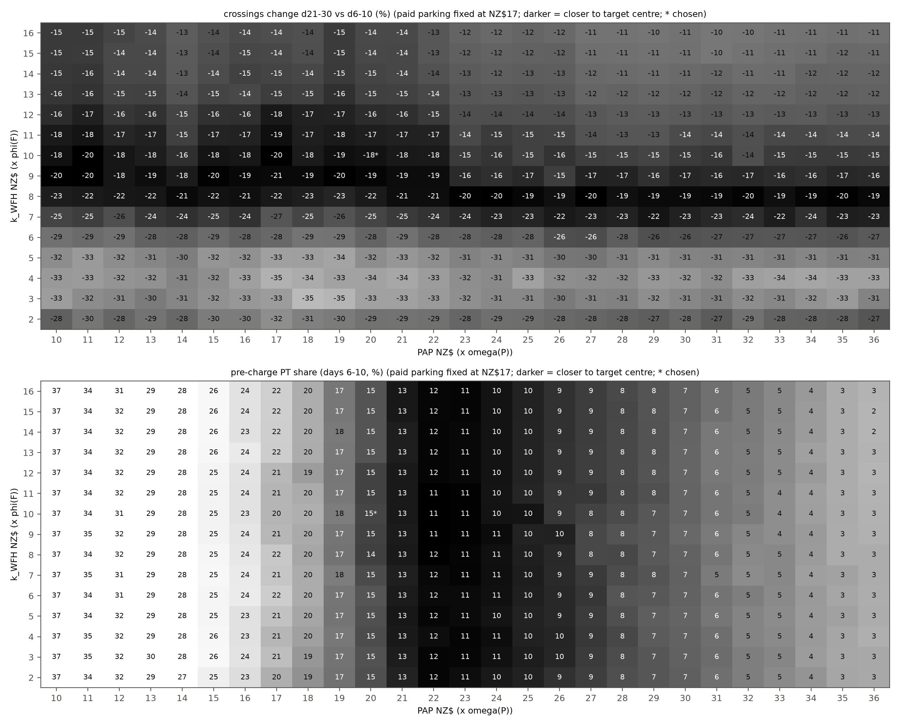
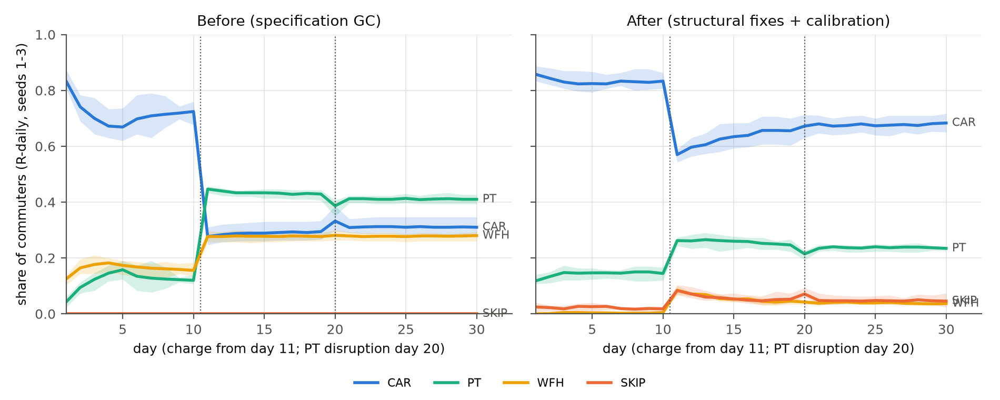
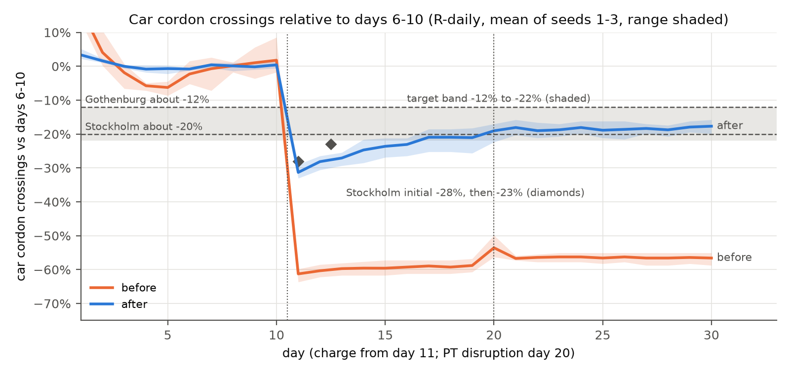

# Behaviour calibration report (archived: SKIP cost NZ$25, no early-start option)

Archived on 2026-10-05. This is the state before the SKIP cost was raised to NZ$30 and the early-start option was added (DEVIATIONS.md, "Early start and SKIP cost"). Log: `data/behaviour_calibration_skip25_noearly.json`; runs: `runs_skip25_noearly/`. The current report is `calibration_report.md`.

Generated by `scripts/calibrate_behaviour.py` (data: `data/behaviour_calibration.json`). R-daily arm, rule decider, PyEngine, n = 300, 30 days, seeds 1-3 (held-out seeds 4-5 and, after the selection, unseen seeds 6-12 for checking only). The LLM arms are never calibrated. Capacity is recalibrated per seed and per evaluated point with `cordonlite.run.calibrate` (car-weighted peak 15-min queue delay of 15 min, days 6-10, no charge).

## Targets (all stated assumptions)

| Target | Band | Centre | Meaning |
|---|---|---|---|
| `base_car` | 0.75 to 0.85 | 0.8 | car share, mean of days 6-10 (pre-charge), R-daily |
| `base_pt` | 0.08 to 0.15 | 0.115 | PT share, days 6-10 |
| `base_wfh` | 0 to 0.1 | - | WFH share, days 6-10 (at most) |
| `base_skip` | 0 to 0.02 | - | SKIP share, days 6-10 (at most) |
| `change_21_30` | -0.22 to -0.12 | -0.2 | car cordon crossings, mean days 21-30 vs mean days 6-10 |
| `change_11_13` | -0.3 to 0 | - | overshoot, mean days 11-13 vs days 6-10 (may reach about -30%) |

Response anchors: Stockholm about -20% (an initial -28%, then -23%, settling at 20-22%), Gothenburg about -12% (Börjesson et al. 2012, Transport Policy 20:1-12; Börjesson and Kristoffersson 2015, TR-A 75:134-146). Single-seed tolerance: shares ±0.05, response ±4 pp.

**Comparability of the anchors.** The Stockholm and Gothenburg figures are reductions of total cordon-crossing traffic in charged hours (all vehicles and purposes), observed over months to years. v3 section 10.5 lists them as soft checks, notes that private-car elasticities (-0.85 to -1.9) are about twice the total-traffic ones (-0.4 to -0.9), and asks for the comparison to be reported as qualitative only. The target here is a hard band on AM car-commuter crossings over days 21-30, and days 11-13 stand in for Stockholm's early -28% then -23%. A private-car commuter response is likely larger than the total-traffic one, and the observed trajectory unfolded over months, not days. The band is therefore a stated assumption that puts the rule arm in a plausible range, not a validation. Auckland-specific support is indicative only: AT option 1a (v3 10.5) implies AM-peak vehicle trips of about -3,600 against about 19,000 charged vehicles (about 19%).

## Structural fixes (applied before the search)

- **memory.ref_fee_update**: all_days (EMA of the fee PAID, 0 on non-car days) -> faced (EMA, alpha = memory.ema_alpha, of the fee FACED at the car reference departure on every day). [v3 5.2 fee-ref, with two differences [A]: on car days the fee actually paid (after retiming) rather than the fee at h0, and alpha 0.3 (SPEC) rather than 0.2]. With the paid fee, agents who left the car kept a reference of 0 and a loss term on the full fee for ever, so the day-11 response could not fade.
- **traits.eta**: [0, 0.5, 1, 2, 3] -> [0, 0.25, 0.5, 0.75, 1]. [v3 4.4 capped variant; De Borger and Fosgerau 2008: a total weight of 4 is generous]. The loss term was larger than the fee itself for day-11 leavers.
- **costs.wfh_form**: spec (WFH = k_WFH x phi; saves car time and parking) -> v3_relative (WFH = k_WFH x phi + VoT/60 x free-flow time + parking + fuel). [v3 6.2: WFH has no PARK term; zero-fee property]. WFH no longer earns the commute, parking and fuel as savings; it still avoids congestion delay, schedule delay and the charge.
- **costs.fuel_cost_per_km**: 0 (no fuel cost; v3 folded fuel into its parking value) -> 0.30 NZ$/km, fixed input (petrol NZ$3.30/L [author-supplied, Oct 2026] x 9.0 L/100 km); car fuel = 2 x path_km x 0.30, 0 for company cars. Driving cost only time, schedule delay, charge and parking, so a calibrated parking value also stood for fuel. Fuel is explicit and is not a calibration scalar.
- **persona.park_cost_paid**: [8, 8, 8, 0, 6] [v3], then searched (17 without fuel, 11 with fuel 0.23) -> [17, 17, 17, 0, 12.75], fixed input [author decision; consistent with the AT 2014 Victoria St daily rate]. Paid parking is set from real-world knowledge and is no longer a calibration scalar.
- **clock.discontinuity_triggers**: [T1, T2, T4, T6] -> [T1, T4, T6]. [A, Verplanken et al. 2008]: habit discontinuity is a change of the performance context; a price change leaves route, time and cues intact, so kappa_H is no longer halved at the charge wake.
- **costs.pt_attitude_penalty**: 0 -> PAP x omega(P), searched in 10-36. [v3 6.2 PAP NZ$8, swept {4, 8, 12}, in v3's form omega(P) x PAP x HTA/2]; free scalar 1 of 2 (the other is k_WFH, searched in 2-16), entered in the specification form omega(P) x (VoT/60 x T_pt + PAP), so the value is not comparable with v3's.
- **engine capacity**: seed-1 scale used for every seed -> recalibrated per seed and per evaluated point; data/calibration.json holds by_seed records. Pre-charge congestion feeds back on the response.

## Parking and fuel fixed by the authors

Two inputs are fixed from real-world knowledge and are not calibrated (2026-10-03). **Paid parking** is NZ$17 a day for office archetypes (student NZ$12.75; trades and company vehicles 0) [author decision; consistent with the AT 2014 Victoria St daily rate already noted in config comments]. It was a searched scalar before (NZ$17 without a fuel cost, NZ$11 with fuel at NZ$0.23/km). **Fuel** is 2 x path_km x NZ$0.30/km (round trip, to the cent; 0 for company cars and work vehicles): petrol NZ$3.30/L [author-supplied, Oct 2026] x 9.0 L/100 km (Metcalfe and Sridhar 2016 for the Ministry of Transport) = 0.297, rounded to 0.30; mean NZ$8.6 a day for a driver who pays it (seeds 1-3: 8.5, 8.7, 8.8). The petrol price was supplied by the authors and has not been verified against a published series here (the MBIE weekly series gave NZ$2.53/L for September 2025 and NZ$2.97/L for September 2026). Under `wfh_form = "v3_relative"` WFH carries parking and fuel, so WFH earns no credit for the avoided drive. The prompt of the LLM arms states both daily costs.

The search now runs over two scalars only, PAP and k_WFH, with the same targets, seeds, loss and selection rule. Earlier searches are archived: `data/behaviour_calibration_pre_fuel.json` with `docs/calibration_report_pre_fuel.md` (no fuel, three scalars) and `data/behaviour_calibration_fuel023_park11.json` with `docs/calibration_report_fuel023_park11.md` (fuel NZ$0.23/km, three scalars).

| | Without fuel (archived) | Fuel NZ$0.23/km, parking searched (archived) | Fuel NZ$0.30/km, parking fixed (this report) |
|---|---|---|---|
| Fuel cost | none | NZ$0.23/km, fixed | NZ$0.30/km, fixed |
| Paid parking, office (student) | NZ$17 (NZ$12.75), searched | NZ$11 (NZ$8.25), searched | NZ$17 (NZ$12.75), fixed |
| Searched scalars | PAP, parking, k_WFH | PAP, parking, k_WFH | PAP, k_WFH |
| PAP (x omega(P)) | NZ$11 | NZ$12 (grid edge) | NZ$20 (interior) |
| k_WFH (x phi(F)) | NZ$8 (grid edge) | NZ$8 (grid edge) | NZ$10 (interior) |
| Feasible points | 2 of 127 (after rounding) | 0 of 178 | 0 of 405 |
| Car share d6-10 (0.75-0.85) | 0.853 | 0.835 | 0.830 |
| PT share d6-10 (0.08-0.15) | 0.137 | 0.154 | 0.147 |
| WFH share d6-10 (at most 0.10) | 0.009 | 0.009 | 0.003 |
| SKIP share d6-10 (at most 0.02) | 0.000 | 0.001 | 0.020 |
| Crossings d11-13 vs d6-10 (to about -30%) | -29.4% | -30.9% | -28.8% |
| Crossings d21-30 vs d6-10 (-12% to -22%) | -20.9% | -20.3% | -18.4% |
| Capacity scale (mean of seeds 1-3) | 0.447 | 0.444 | 0.441 |

With parking back at NZ$17 and fuel at NZ$0.30/km a paying driver's money cost is about NZ$26 a day before any charge (parking plus fuel), against about NZ$18 in the two earlier states. Driving is therefore much dearer, and PAP rises to hold the assumed pre-charge shares: from 12 to 20. Two side effects follow. Some commuters for whom both driving and PT are now costly postpone the trip, so the SKIP share is no longer near zero (0.001 before, 0.020 now). And with k_WFH left at 8 the days 11-13 fall would be beyond its bound (-34.0% at PAP 20), so the search raises k_WFH to 10.

## Search

405 grid points x 3 seeds = 1215 evaluations, each with its own capacity calibration. Full grid in NZ$1 steps: PAP 10 to 36, k_WFH 2 to 16, paid parking fixed at NZ$17. The ranges were set after a range-finding probe (PAP 12 to 40 in steps of 4 at k_WFH 8 and 12, seeds 1-3; logged as `search.range_probe`) and before the search. Selection: lexicographic: (1) feasible = every 3-seed mean in its target band at the targets' stated precision (shares to 2 decimals, changes to whole percent) and every seed within the stated single-seed tolerance; (2) among feasible points, the smallest squared relative distance to the anchors (PAP 8 [v3], paid parking 17 [AT car-park all-day rate 2014], k_WFH 8 [v3]); (3) loss as tie-break. If no point is feasible, the lowest loss. Loss: Loss of one grid point over its seeds. centre: sum of squared (3-seed mean - centre) / scale for base car, base PT and the d21-30 response (scales 0.05, 0.035, 0.04); band: squared band excess of the 3-seed means for every target (scale 0.02), plus squared excess beyond the stated single-seed tolerance for each seed; prior: 0.02 x sum of squared relative distances of the scalars from the v3 values (8, 8, 8), a weak tie-break toward the design-note values. Paid parking is constant, so its terms in the anchor distance (0) and in the prior (a constant) do not affect the ranking.

0 of 405 points are feasible at the stated precision (shares to 2 decimals, changes to whole percent); strictly (unrounded 3-seed means) 0 are. With no feasible point the rule falls back to the lowest loss, which gives pap20_park17_wfh10. Every 3-seed mean of the chosen point is inside its band. The point is not feasible because of the single-seed rule: seed 2 `base_skip` 0.025 (beyond the band plus tolerance by 0.005); seed 3 `base_skip` 0.025 (beyond the band plus tolerance by 0.005). The single-seed tolerance for the SKIP share is 0, so a seed with a SKIP share above 0.02 fails. Neither chosen value is on an edge of its searched range.

Sensitivity to the soft overshoot bound ('may reach about -30%', treated as a hard bound): bound -30.0%: 0 feasible, chosen pap20_park17_wfh10; bound -31.0%: 0 feasible, chosen pap20_park17_wfh10; bound -32.0%: 0 feasible, chosen pap20_park17_wfh10; bound -33.0%: 0 feasible, chosen pap20_park17_wfh10. The anchors (PAP 8, k_WFH 8) act only inside a feasible set.

Selection history (append-only from this version; `search.selection_history`): Earlier versions of the selection rule and anchors were overwritten by --stage select and are not recoverable from this log. What is known: the coarse grid (paid parking 8, 10, 12, 15, 18) was run first; the paid-parking anchor NZ$17 is not on it and entered with the refinement grid (parking 14-18 at k_WFH 8) along the PAP-parking ridge that the coarse grid had located, so the NZ$17 anchor was fixed after coarse-grid results had been seen. From this version on, --stage select appends the rule, anchors and choice it replaces to this list. 2026-10-03: fuel cost added to the car option (costs.fuel_cost_per_km, fixed from evidence, not searched) and the search rerun with the paid-parking grid moved downward. This replaces the search without fuel, which chose pap11_park17_wfh8 under the same rule and anchors; its full log is kept in data/behaviour_calibration_pre_fuel.json and its report in docs/calibration_report_pre_fuel.md. 2026-10-03: paid parking fixed at NZ$17 by the authors and the fuel cost raised to NZ$0.30/km (author-supplied petrol price for October 2026); parking is no longer searched and the search was rerun over PAP and k_WFH only, on a wider grid. This replaces the three-scalar search with fuel NZ$0.23/km, which chose pap12_park11_wfh8 (no feasible point, lowest loss) under the same rule; its full log is kept in data/behaviour_calibration_fuel023_park11.json and its report in docs/calibration_report_fuel023_park11.md.

Feasible points and the ten lowest-loss points (3-seed means):

| PAP | k_WFH | feasible | anchor dist. | loss | base car | base PT | base WFH | base SKIP | d11-13 | d21-30 |
|---|---|---|---|---|---|---|---|---|---|---|
| 20 | 9 | no | 2.266 | 1.85 | 0.830 | 0.146 | 0.004 | 0.020 | -31.4% | -19.5% |
| 20 | 10 | no | 2.312 | 1.57 | 0.830 | 0.147 | 0.003 | 0.020 | -28.8% | -18.4% |
| 20 | 11 | no | 2.391 | 1.81 | 0.833 | 0.146 | 0.002 | 0.019 | -27.0% | -17.4% |
| 20 | 12 | no | 2.500 | 2.24 | 0.833 | 0.146 | 0.001 | 0.019 | -25.7% | -16.3% |
| 21 | 9 | no | 2.656 | 1.82 | 0.839 | 0.129 | 0.006 | 0.027 | -30.3% | -18.9% |
| 21 | 10 | no | 2.703 | 2.01 | 0.842 | 0.128 | 0.003 | 0.026 | -28.5% | -17.8% |
| 21 | 11 | no | 2.781 | 2.28 | 0.843 | 0.128 | 0.002 | 0.026 | -26.3% | -17.1% |
| 21 | 12 | no | 2.891 | 2.74 | 0.844 | 0.128 | 0.002 | 0.026 | -25.6% | -16.2% |
| 22 | 9 | no | 3.078 | 2.53 | 0.852 | 0.115 | 0.005 | 0.029 | -29.3% | -18.9% |
| 22 | 10 | no | 3.125 | 2.72 | 0.854 | 0.115 | 0.002 | 0.029 | -26.9% | -17.7% |

Chosen: **PAP NZ$20 x omega(P), k_WFH NZ$10 x phi(F)**, with paid parking fixed at NZ$17/day (student NZ$12.75) and fuel fixed at NZ$0.30/km.

How to read the chosen values. PAP enters in the specification form omega(P) x (VoT/60 x T_pt + PAP) + fare: omega also scales PT time, and v3's HTA/2 factor is absent. v3 6.2 uses omega(P) x PAP x HTA/2 (HTA 1 local, 2 boundary) with PAP 8 swept {4, 8, 12}, so Cordon-Lite's 20 x omega equals v3 PAP 20 (boundary homes) to 40 (local homes), far above v3's range; P = 1-2 agents also face doubled or 1.5 x PT time and practically never ride PT. PAP is the one scalar left to hold the assumed baseline split, so it absorbs the whole rise in the money cost of driving: it is a fitted residual, not an estimate of a PT attitude. k_WFH 10 is above v3's NZ$8; it is identified here by the response and overshoot targets (a higher value weakens both), not by the WFH share, which stays near zero. Parking and fuel are no longer fitted, so the earlier caveat that parking was in effect a fitted value no longer applies.

## Before vs after (3-seed means)

| Metric | Target | Before | Structural fixes only (v3 values) | After (chosen) |
|---|---|---|---|---|
| car share d6-10 | 0.75-0.85 | 0.713 | 0.567 | 0.830 |
| PT share d6-10 | 0.08-0.15 | 0.126 | 0.423 | 0.147 |
| WFH share d6-10 | 0-0.1 | 0.161 | 0.008 | 0.003 |
| SKIP share d6-10 | 0-0.02 | 0.000 | 0.002 | 0.020 |
| crossings d11-13 vs d6-10 | -30.0% to +0.0% | -60.4% | -36.6% | -28.8% |
| crossings d21-30 vs d6-10 | -22.0% to -12.0% | -56.5% | -24.5% | -18.4% |
| car share d21-30 | - | 0.311 | 0.427 | 0.677 |
| PT share d21-30 | - | 0.411 | 0.517 | 0.237 |
| WFH share d21-30 | - | 0.278 | 0.053 | 0.039 |
| 08:00-09:00 crossing share d21-30 | - | 0.268 | 0.377 | 0.387 |
| peak delay d6-10 (min) | - | 14.372 | 15.080 | 15.162 |
| peak delay d21-30 (min) | - | 1.641 | 3.243 | 2.647 |
| capacity scale | - | 0.365 | 0.305 | 0.441 |

'Before' is the pre-recalibration specification, which has no fuel cost and paid parking NZ$8. 'Structural fixes only' is the current model, with the fixed parking (NZ$17) and fuel (NZ$0.30/km), at the v3 scalars (PAP 8, k_WFH 8). It has base car 0.567 and PT 0.423, far outside the baseline bands, and responds by -24.5% on days 21-30 and -36.6% on days 11-13 (per seed -21.4%, -21.8%, -30.5%). Without fuel and with v3's NZ$8 parking the v3-valued model gave car 0.968, PT 0.019 and a response of -15.4% (overshoot -25.0%), the like-for-like v3 sensitivity. In the search PAP moved to restore the assumed baseline shares (to 20) and k_WFH to 10, and the response is -18.4%. The closeness to Stockholm's -20% is partly a by-product of fitting the baseline.

## Per-seed metrics against each target (chosen values)

| Seed | capacity scale | base car | base PT | base WFH | base SKIP | d11-13 | d21-30 | within band / tolerance |
|---|---|---|---|---|---|---|---|---|
| 1 | 0.4674 | 0.867 | 0.121 | 0.003 | 0.009 | -28.3% | -18.3% | base_car within tol. |
| 2 | 0.4259 | 0.811 | 0.159 | 0.005 | 0.025 | -31.0% | -20.5% | base_pt within tol.; base_skip OUT; change_11_13 within tol. |
| 3 | 0.4303 | 0.811 | 0.163 | 0.001 | 0.025 | -27.3% | -16.4% | base_pt within tol.; base_skip OUT |
| 4 (held out) | 0.3961 | 0.795 | 0.159 | 0.023 | 0.022 | -24.7% | -14.9% | base_pt within tol.; base_skip OUT |
| 5 (held out) | 0.4303 | 0.805 | 0.166 | 0.012 | 0.017 | -27.2% | -19.3% | base_pt within tol. |

Target status on the calibration seeds 1-3:

- `base_car`: mean 0.830 (in band); seeds in band 2/3, within tolerance 3/3.
- `base_pt`: mean 0.147 (in band); seeds in band 1/3, within tolerance 3/3.
- `base_wfh`: mean 0.003 (in band); seeds in band 3/3, within tolerance 3/3.
- `base_skip`: mean 0.020 (in band); seeds in band 1/3, within tolerance 1/3.
- `change_21_30`: mean -0.184 (in band); seeds in band 3/3, within tolerance 3/3.
- `change_11_13`: mean -0.288 (in band); seeds in band 2/3, within tolerance 3/3.

## Out-of-sample seeds and the ridge alternatives

Out-of-sample checks run after the selection; they did not influence it. Capacity is recalibrated per seed as in the search. Seeds 4-5 come from the final stage; seeds 6-12 were never run before the selection.

| Seed | capacity scale | base car | base PT | base WFH | base SKIP | d11-13 | d21-30 | outside band / tolerance |
|---|---|---|---|---|---|---|---|---|
| 4 | 0.3961 | 0.795 | 0.159 | 0.023 | 0.022 | -24.7% | -14.9% | base_pt within tol.; base_skip OUT of tol. |
| 5 | 0.4303 | 0.805 | 0.166 | 0.012 | 0.017 | -27.2% | -19.3% | base_pt within tol. |
| 6 | 0.4303 | 0.833 | 0.126 | 0.017 | 0.025 | -20.6% | -9.3% | base_skip OUT of tol.; change_21_30 within tol. |
| 7 | 0.4303 | 0.801 | 0.162 | 0.000 | 0.037 | -23.3% | -17.9% | base_pt within tol.; base_skip OUT of tol. |
| 8 | 0.3961 | 0.781 | 0.194 | 0.005 | 0.020 | -27.0% | -15.0% | base_pt within tol. |
| 9 | 0.4674 | 0.818 | 0.135 | 0.010 | 0.037 | -26.7% | -17.3% | base_skip OUT of tol. |
| 10 | 0.4485 | 0.839 | 0.143 | 0.002 | 0.015 | -24.1% | -16.8% | all in band |
| 11 | 0.4303 | 0.791 | 0.173 | 0.004 | 0.031 | -28.8% | -17.4% | base_pt within tol.; base_skip OUT of tol. |
| 12 | 0.4215 | 0.806 | 0.158 | 0.017 | 0.019 | -27.5% | -18.5% | base_pt within tol. |

| Point | seeds | base car | base PT | base SKIP | d11-13 | d21-30 |
|---|---|---|---|---|---|---|
| chosen PAP 20 / k_WFH 10 | 1-3 (calibration) | 0.830 | 0.147 | 0.020 | -28.8% | -18.4% |
| chosen PAP 20 / k_WFH 10 | 4-12 | 0.808 | 0.157 | 0.025 | -25.6% | -16.3% |
| chosen PAP 20 / k_WFH 10 | 6-12 (unseen) | 0.810 | 0.156 | 0.026 | -25.4% | -16.0% |
| chosen PAP 20 / k_WFH 10 | 1-12 | 0.813 | 0.155 | 0.024 | -26.4% | -16.8% |
| PAP 20 / k_WFH 9 | 1-3 (calibration) | 0.830 | 0.146 | 0.020 | -31.4% | -19.5% |
| PAP 20 / k_WFH 9 | 4-12 | 0.812 | 0.156 | 0.023 | -28.2% | -18.6% |
| PAP 20 / k_WFH 11 | 1-3 (calibration) | 0.833 | 0.146 | 0.019 | -27.0% | -17.4% |
| PAP 20 / k_WFH 11 | 4-12 | 0.816 | 0.154 | 0.024 | -24.9% | -16.1% |

Out of sample the response is -16.0% on unseen seeds 6-12 (in band; -16.8% over seeds 1-12), with an overshoot of -25.4% (in band; -26.4% over seeds 1-12). Over seeds 1-12 base car is 0.813 (in band), base PT 0.155 (in band) and base SKIP 0.024 (in band), all at the stated precision. On the unseen seeds 6-12 alone base car is 0.810 (in band), base PT 0.156 (OUT of band) and base SKIP 0.026 (OUT of band). Single seeds outside the stated tolerance: seed 4 `base_skip` 0.022; seed 6 `base_skip` 0.025; seed 7 `base_skip` 0.037; seed 9 `base_skip` 0.037; seed 11 `base_skip` 0.031. The ridge alternatives (PAP 20 / k_WFH 9, PAP 20 / k_WFH 11) give on seeds 4-12 (-18.6%, overshoot -28.2%, -16.1%, overshoot -24.9%) against the chosen point (-16.3%, -25.6%). The choice was not changed after seeing these seeds.

## What would close the gap (sensitivities, not adopted)

Run after the selection and not adopted. Each variant changes one assumption at the chosen PAP and k_WFH (no new search), on seeds 1-3 with nested capacity calibration, to see which single additional assumption would remove the single-seed SKIP failures.

| Variant (at the chosen PAP and k_WFH) | feasible | base car | base PT | base WFH | base SKIP (per seed) | d11-13 | d21-30 |
|---|---|---|---|---|---|---|---|
| postponing costs NZ$30 + 1 h of VoT (costs.skip_cost 25 -> 30) | no | 0.829 | 0.161 | 0.006 | 0.004 (0.000, 0.003, 0.009) | -23.6% | -14.5% |
| postponing costs NZ$35 + 1 h of VoT (costs.skip_cost 25 -> 35) | no | 0.839 | 0.156 | 0.004 | 0.001 (0.000, 0.000, 0.002) | -22.8% | -14.4% |
| fuel NZ$0.27/km (MBIE petrol price, September 2026, NZ$2.97/L) | no | 0.846 | 0.135 | 0.004 | 0.015 (0.005, 0.018, 0.022) | -27.6% | -16.6% |
| fuel NZ$0.23/km (MBIE petrol price, September 2025, the base year of the fare and charge) | no | 0.859 | 0.125 | 0.006 | 0.010 (0.000, 0.015, 0.014) | -23.0% | -13.6% |

Local re-search under each changed assumption (PAP 17 to 24, k_WFH 7 to 11, seeds 1-3, same rule; logged as `gap_sensitivity.research`, never adopted):

| Changed assumption | feasible points | the rule would choose | base car | base PT | base SKIP (per seed) | d11-13 | d21-30 |
|---|---|---|---|---|---|---|---|
| postponing costs NZ$30 + 1 h of VoT (costs.skip_cost 25 -> 30) | 7 of 40 | PAP 21 / k_WFH 8 (feasible) | 0.843 | 0.145 | 0.003 (0.000, 0.003, 0.006) | -28.2% | -18.8% |
| postponing costs NZ$35 + 1 h of VoT (costs.skip_cost 25 -> 35) | 9 of 40 | PAP 21 / k_WFH 8 (feasible) | 0.842 | 0.148 | 0.000 (0.000, 0.000, 0.000) | -27.1% | -17.6% |
| fuel NZ$0.27/km (MBIE petrol price, September 2026, NZ$2.97/L) | 1 of 40 | PAP 19 / k_WFH 11 (feasible) | 0.838 | 0.152 | 0.009 (0.002, 0.009, 0.015) | -26.1% | -16.9% |
| fuel NZ$0.23/km (MBIE petrol price, September 2025, the base year of the fare and charge) | 7 of 40 | PAP 18 / k_WFH 9 (feasible) | 0.836 | 0.152 | 0.005 (0.000, 0.003, 0.013) | -29.2% | -17.2% |

At the chosen PAP and k_WFH none of the four single changes is feasible without a new search, because each also moves the baseline split (commuters who no longer postpone drive or ride PT instead). With a local re-search every one of them gives feasible points. The most direct is the assumed cost of postponing (`costs.skip_cost`, NZ$25 [A]): it was set when a day's driving cost a paying commuter about NZ$18 in parking and fuel, against about NZ$26 now, and NZ$30 removes the SKIP failures (per-seed SKIP 0.000 to 0.006) with the response still in band. The base-year reading points the same way: the petrol price is an October 2026 value, while the PT fare, the charge schedule and the SKIP cost are 2025 or earlier values, and fuel at the 2025 price (NZ$0.23/km) also gives feasible points. None of these changes is adopted; the choice is the authors'.

## Retiming

Measured against a no-charge run at the same capacity and seed (days 21-30), because the no-charge run has the same day-to-day churn and congestion feedback.

| Seed | 08:00-09:00 share, charge | same, no charge | 07:00-08:00 share, charge | same, no charge |
|---|---|---|---|---|
| 1 | 0.415 | 0.404 | 0.378 | 0.363 |
| 2 | 0.402 | 0.389 | 0.350 | 0.333 |
| 3 | 0.344 | 0.424 | 0.427 | 0.388 |

08:00-09:00 crossing share under the charge minus no charge: +0.011, +0.014, -0.079 (seeds 1-3); 07:00-08:00: +0.015, +0.016, +0.039. Peak spreading is NOT visible in every seed.

Crossings per day before 07:30 (NZ$4 or less): seed 1: 53.9 with the charge vs 57.2 without, seed 2: 47.9 with the charge vs 52.1 without, seed 3: 57.0 with the charge vs 50.8 without.

- Crossings per day 06:00-07:30 (NZ$4 or less), days 21-30, mean of seeds 1-3: 52.9 with the charge, 53.4 without (-1%).
- Crossings per day 08:00-09:00 (NZ$6), days 21-30, mean of seeds 1-3: 78.7 with the charge, 100.8 without (-22%).
- Crossings per day 09:30-10:15 (back to NZ$4), days 21-30, mean of seeds 1-3: 9.4 with the charge, 7.8 without (+21%).

Paired check (common random numbers: the charged and no-charge runs share every rule noise draw): among agents who drive at days 26-30 in both runs (n = 556, seeds 1-3), 33.5% [29.7%, 37.5%] have a different modal departure with the charge (13.7% earlier, 19.8% later; mean shift +1.2 min). By F level: F1 0.30 [0.20, 0.43] n=60; F2 0.27 [0.19, 0.36] n=104; F3 0.32 [0.27, 0.38] n=251; F4 0.38 [0.29, 0.48] n=95; F5 0.50 [0.36, 0.64] n=46.

## Trait monotonicity

### Who adapts on the calibrated runs

Day-10 drivers (modal option days 6-10 a car option, twins and company cars excluded), pooled over seeds 1-3, share with 95% Wilson interval; in brackets the same share in the no-charge counterfactual (churn and selection baseline).

- **H -> drives on day 11** (not monotone): L1 0.59 [0.41, 0.74] n=29 (1.00) | L2 0.65 [0.52, 0.77] n=52 (1.00) | L3 0.57 [0.48, 0.65] n=134 (0.98) | L4 0.65 [0.58, 0.71] n=196 (0.99) | L5 0.72 [0.65, 0.79] n=158 (0.99)
- **H -> car user d26-30** (not monotone): L1 0.83 [0.65, 0.92] n=29 (1.00) | L2 0.77 [0.64, 0.86] n=52 (0.94) | L3 0.79 [0.71, 0.85] n=134 (0.99) | L4 0.82 [0.76, 0.86] n=196 (0.98) | L5 0.75 [0.67, 0.81] n=158 (0.97)
- **P -> PT user d26-30 (PT-feasible day-10 drivers)** (monotone up): L1 0.00 [0.00, 0.06] n=60 (0.00) | L2 0.00 [0.00, 0.03] n=133 (0.00) | L3 0.18 [0.13, 0.24] n=216 (0.02) | L4 0.21 [0.14, 0.31] n=86 (0.02) | L5 0.31 [0.18, 0.49] n=32 (0.06)
- **P -> PT user d26-30 (all PT-feasible agents)** (monotone up): L1 0.00 [0.00, 0.06] n=64 (0.00) | L2 0.00 [0.00, 0.03] n=146 (0.00) | L3 0.25 [0.20, 0.30] n=261 (0.09) | L4 0.51 [0.43, 0.59] n=155 (0.41) | L5 0.63 [0.51, 0.73] n=67 (0.52)
- **F -> retimed d26-30 (car keepers)** (not monotone): L1 0.29 [0.18, 0.43] n=45 (0.27) | L2 0.29 [0.20, 0.39] n=83 (0.32) | L3 0.38 [0.32, 0.45] n=208 (0.39) | L4 0.54 [0.43, 0.64] n=78 (0.48) | L5 0.50 [0.34, 0.66] n=34 (0.54)
- **S -> drives on day 11** (not monotone): L1 0.79 [0.66, 0.87] n=56 (1.00) | L2 0.75 [0.67, 0.82] n=114 (0.97) | L3 0.62 [0.55, 0.68] n=233 (0.99) | L4 0.56 [0.47, 0.65] n=112 (1.00) | L5 0.57 [0.44, 0.70] n=54 (0.98)
- **S -> car user d26-30** (not monotone): L1 0.77 [0.64, 0.86] n=56 (0.98) | L2 0.83 [0.75, 0.89] n=114 (0.98) | L3 0.77 [0.71, 0.82] n=233 (0.97) | L4 0.79 [0.70, 0.85] n=112 (0.99) | L5 0.78 [0.65, 0.87] n=54 (0.98)

### Population trait manipulation (unbiased check)

Every agent set to one level (1-5) of one trait (others drawn as usual), capacity fixed at the chosen point's per-seed scale, mean of seeds 1-3. Retiming and peak-band shares are differences from the no-charge run at the same setting.

| Trait | Level | d11-13 | d21-30 | PT share d6-10 | PT share d21-30 minus no-charge | day-10 drivers to PT | 08-09 share minus no-charge | retimed keepers minus no-charge |
|---|---|---|---|---|---|---|---|---|
| H | 1 | -30.3% | -17.4% | 0.151 | +0.070 | 0.082 | +0.009 | -0.010 |
| H | 2 | -31.6% | -16.9% | 0.154 | +0.075 | 0.095 | +0.023 | -0.044 |
| H | 3 | -31.2% | -16.9% | 0.153 | +0.080 | 0.097 | +0.016 | -0.041 |
| H | 4 | -29.2% | -17.7% | 0.152 | +0.094 | 0.107 | -0.021 | +0.019 |
| H | 5 | -22.5% | -17.9% | 0.154 | +0.103 | 0.107 | -0.072 | +0.042 |
| F | 1 | -22.1% | -13.1% | 0.161 | +0.071 | 0.101 | +0.031 | +0.051 |
| F | 2 | -22.4% | -12.7% | 0.163 | +0.080 | 0.097 | +0.016 | +0.031 |
| F | 3 | -25.8% | -13.6% | 0.155 | +0.093 | 0.105 | -0.011 | +0.000 |
| F | 4 | -36.0% | -23.6% | 0.148 | +0.087 | 0.099 | -0.072 | +0.049 |
| F | 5 | -41.7% | -36.1% | 0.140 | +0.087 | 0.107 | -0.136 | +0.031 |
| P | 1 | -24.7% | -10.2% | 0.000 | +0.000 | 0.000 | +0.047 | +0.029 |
| P | 2 | -24.7% | -10.2% | 0.000 | +0.000 | 0.000 | +0.048 | +0.028 |
| P | 3 | -28.0% | -18.7% | 0.104 | +0.136 | 0.142 | +0.000 | -0.033 |
| P | 4 | -25.9% | -20.4% | 0.350 | +0.105 | 0.175 | -0.097 | +0.103 |
| P | 5 | -29.3% | -21.3% | 0.449 | +0.099 | 0.180 | -0.093 | +0.040 |
| S | 1 | -18.0% | -16.6% | 0.147 | +0.079 | 0.097 | +0.004 | -0.001 |
| S | 2 | -24.2% | -17.9% | 0.147 | +0.086 | 0.102 | -0.004 | -0.010 |
| S | 3 | -29.3% | -18.7% | 0.147 | +0.090 | 0.107 | -0.016 | -0.002 |
| S | 4 | -35.3% | -19.6% | 0.147 | +0.091 | 0.110 | -0.035 | +0.011 |
| S | 5 | -40.0% | -20.6% | 0.147 | +0.093 | 0.111 | -0.039 | +0.026 |

- H, day 11-13 response (levels 1-5): -30.3%, -31.6%, -31.2%, -29.2%, -22.5%; linear trend +1.79 pp per level: NOT strictly monotone
- H, day 21-30 response: -17.4%, -16.9%, -16.9%, -17.7%, -17.9%; trend -0.16 pp per level: NOT monotone (habit re-forms on the new mode at once, so high H also keeps leavers on PT)
- P, PT share at days 21-30 caused by the charge (charge minus no-charge run): +0.000, +0.000, +0.136, +0.105, +0.099: NOT monotone
- P, PT share at days 21-30 with the charge: 0.000, 0.000, 0.235, 0.457, 0.546: rises with P (monotone)
- P, share of day-10 drivers on PT at days 26-30: 0.000, 0.000, 0.142, 0.175, 0.180 (selection: at P = 5 most PT-feasible agents already ride PT before the charge, so the remaining drivers are those for whom PT is poor)
- F, 08:00-09:00 share minus no-charge: +0.031, +0.016, -0.011, -0.072, -0.136: more peak spreading with higher F (monotone)
- F, retimed keepers minus no-charge: +0.051, +0.031, +0.000, +0.049, +0.031: NOT strictly monotone (trend -0.002 per level)
- S, day 21-30 response: -16.6%, -17.9%, -18.7%, -19.6%, -20.6%: stronger with higher S (monotone)
- S, day 11-13 response: -18.0%, -24.2%, -29.3%, -35.3%, -40.0%: stronger with higher S (monotone)

### Where the F gradient comes from

Same population manipulation (every agent at one F level, capacity fixed, seeds 1-3), split by margin. Differences are charge minus no-charge run at the same setting, days 21-30.

| F | d21-30 | car share | PT share | WFH share | WFH share with charge (seeds 1-3) | retimed keepers, charge | same, no charge |
|---|---|---|---|---|---|---|---|
| 1 | -13.1% | -0.099 | +0.071 | -0.001 | 0.000, 0.000, 0.000 | 0.355 | 0.304 |
| 2 | -12.7% | -0.110 | +0.080 | -0.003 | 0.000, 0.000, 0.000 | 0.381 | 0.350 |
| 3 | -13.6% | -0.127 | +0.093 | +0.000 | 0.007, 0.002, 0.000 | 0.387 | 0.387 |
| 4 | -23.6% | -0.201 | +0.087 | +0.083 | 0.110, 0.087, 0.076 | 0.502 | 0.454 |
| 5 | -36.1% | -0.310 | +0.087 | +0.194 | 0.207, 0.178, 0.215 | 0.526 | 0.495 |

The F response gradient comes mainly from F = 4-5 hybrid workers switching to daily WFH, which is unbounded without v3's WFH quota; PT gains barely vary with F. Retiming of car keepers against the no-charge run is flat across F (the paired departure change rises with F, 0.30 to 0.50, but retiming in the no-charge run rises with F too). The F response gradient is therefore not evidence for the 'high F retimes more' target.

## Limits

- The targets are stated assumptions, and the response anchors are not like-for-like: Stockholm and Gothenburg measured total cordon traffic in charged hours over months to years, while the band here applies to AM car commuters over days 21-30. v3 10.5 asks for a qualitative comparison only; the private-car commuter response is likely larger than the total-traffic one.
- No grid point is feasible. At the chosen point (PAP 20, k_WFH 10) every 3-seed mean is inside its band (base car 0.830, PT 0.147, WFH 0.003, SKIP 0.020, days 11-13 -28.8%, days 21-30 -18.4%), but the single-seed rule fails on the SKIP share: seeds 2 and 3 have 0.025 against a bound of 0.02 with a single-seed tolerance of 0 (a miss of 0.005, about 1.5 commuters a day). The mean SKIP share (0.0198) is at the bound. The chosen point is therefore the rule's fallback, the lowest loss. The targets were not relaxed.
- The fit is weaker out of sample than on the calibration seeds. On unseen seeds 6-12 the response is -16.0% (in band) and the overshoot -25.4%, but base PT is 0.156 (0.16 at the stated precision, above the 0.15 bound) and base SKIP 0.026 (0.03, above the 0.02 bound). Seed 6 responds by only -9.3% (outside the band, within tolerance). SKIP exceeds 0.02 on held-out seed 4 (0.022) and unseen seeds 6, 7, 9 and 11 (0.025 to 0.037).
- Postponing is now part of the response. With paid parking NZ$17 and fuel at NZ$0.30/km a paying driver's money cost is about NZ$26 a day before any charge, close to the assumed cost of postponing (NZ$25 plus one hour of VoT). For commuters who also dislike PT (P = 1-2, where PAP 20 is multiplied by 1.5 to 2) SKIP becomes the next-best option, and under the charge the SKIP share rises from 0.020 (days 6-10) to 0.047 (days 21-30, seeds 1-3: 0.037, 0.066, 0.038). Of the fall in car share from 0.830 to 0.677, about 0.09 goes to PT, 0.04 to WFH and 0.03 to postponed trips. A single-agent check shows the same: with paid parking and a 20 km path nobody retimes on the charge morning, and the flexible, cost-salient persona postpones (tests/test_rules.py).
- What would close the gap (section above; none adopted). Raising the assumed cost of postponing (costs.skip_cost, NZ$25 [A]) to NZ$30 gives 7 feasible points in a local re-search (PAP 21 / k_WFH 8 chosen: base SKIP 0.003, response -18.8%, overshoot -28.2%). Putting fuel at the 2025 price that matches the base year of the fare and charge (NZ$0.23/km) gives 7 feasible points as well, and the MBIE September 2026 price (NZ$0.27/km) gives 1. The base years are mixed: the petrol price is an October 2026 value, the PT fare, charge schedule and SKIP cost are 2025 or earlier values and the parking rate is from 2014.
- PAP is a fitted residual. With parking and fuel fixed, PAP is the only scalar that can hold the assumed pre-charge split, and it rises to 20 (v3 PAP 20-40 in v3's form, against v3's NZ$8 swept 4-12). At PAP 20 commuters with P = 1-2 never ride PT (PT share 0.000 in the population manipulation), so PT use is confined to P = 3-5. The baseline shares react sharply to PAP (base PT 0.177 at PAP 19, 0.147 at 20, 0.128 at 21, k_WFH 10), while the response barely depends on it (-17.6% to -18.7% for PAP 16-22).
- k_WFH is identified by the response and overshoot, not by the WFH share: at PAP 20 the days 21-30 response is -22.3% at k_WFH 8, -18.4% at 10 and -16.3% at 12, and the overshoot -34.0%, -28.8% and -25.7%, while base WFH stays at 0.00-0.01. A realistic hybrid-work baseline is not reproduced: k_WFH 4 gives about 6% WFH before the charge but a response of -33.5%. v3's WFH quota (1-3 days per 5-day block) would bound this margin; it is not implemented.
- The fixed inputs carry their own uncertainty. The petrol price (NZ$3.30/L) is author-supplied for October 2026 and was not verified here; the last published figure we read was NZ$2.97/L for September 2026. Consumption is 9.0 L/100 km for every paying driver; electric vehicles, fuel cards and other running costs are not represented. Paid parking NZ$17 is a 2014 casual all-day rate, applied to half of office commuters (the other half park free), and v3 warns that parking above NZ$8 fails its zero-fee property for P = 5 local agents.
- The v3-valued model (PAP 8, k_WFH 8) with the fixed parking and fuel has base car 0.567 and PT 0.423, far outside the baseline bands, and responds by -24.5% (overshoot -36.6%). Without fuel and with v3's NZ$8 parking it gave -15.4% (overshoot -25.0%). The scalars were moved to meet the assumed baseline, and the closeness to Stockholm is partly a by-product.
- The choice does not depend on the anchors (no feasible set) or on the soft overshoot bound (the same point is chosen for bounds of -30% to -33%). The neighbours PAP 20 / k_WFH 9 and PAP 20 / k_WFH 11 give -18.6% and -16.1% on seeds 4-12, against -16.3% for the chosen point.
- Capacity is a further calibrated quantity, recalibrated per point and seed; its discrete jumps add noise of a few points to the base shares.
- Retiming is weak, as in the literature (Karlström and Franklin 2009): against the no-charge run the 08:00-09:00 share of crossings falls only in seed 3 (-0.079) and rises slightly in seeds 1 and 2 (+0.011, +0.014). Crossings in the NZ$6 hour fall by 22%, those before 07:30 by 1%, and those after 09:30 rise by 21%, so part of the paired departure change is later departures enabled by the congestion relief. The F response gradient comes mainly from daily WFH of F = 4-5 hybrid workers (no quota); retiming of car keepers is flat across F.
- The v3 worked example (identical A, different B: pay / PT / retime) separates only with the v3 settings (PAP 4 = v3 PAP 8 x HTA/2 for a local home, T2 a habit discontinuity). Under the calibrated defaults the example's free-parking agent, with the fuel cost of its 20 km path (NZ$12), keeps the car at its usual time for 497 of the 625 trait combinations, switches to PT for 120 and retimes for 8 (H = 1 only); the v3 retimer persona (H = 2) does not retime. With paid parking NZ$17 the same agent rides PT before the charge in 250 combinations, and of the other 375 it keeps the car in 146, switches to PT in 93 and postpones in 136; none retimes (tests/test_rules.py).
- H damps the charge wake only at level 5 (overshoot -30.3%, -31.6%, -31.2%, -29.2% at H = 1-4, -22.5% at H = 5), and not in the long run (-16.9% to -17.9%): habit re-forms on the new mode immediately.
- The charge-induced switch to PT is largest at P = 3 (+0.136 against the no-charge run; +0.105 and +0.099 at P = 4-5, 0 at P = 1-2): at P = 4-5 most agents for whom PT is viable already ride PT before the charge (ceiling). The PT share after the charge rises with P (0.00, 0.00, 0.24, 0.46, 0.55).
- Who-adapts tables conditional on being a day-10 driver are biased by selection; the population manipulation is the unbiased check.
- The reference fee follows the fee faced, but on car days it uses the fee actually paid (after retiming; v3 uses the fee at h0 before retiming) and alpha 0.3 (SPEC; v3 0.2), so a retimer keeps a loss term on returning to the peak.
- Clock arms keep more of the day-11 response than R-daily (R-clock -22% to -27% against -16% to -21%, seeds 1-3), but the gap is smaller than before, because a standing SKIP is never a plan: commuters who postpone are woken again every morning (T6), so the clock arms now make 150 to 270 decisions after day 12 outside the disruption days. The LLM deciders are not calibrated, but the shared Layer A inputs (parking NZ$17 and the fuel cost) reach the LLM prompt. The rule's WFH earns no parking, fuel or commute credit while the prompt states both daily costs (about NZ$26 together for a paying driver), so live-LLM WFH shares are not comparable with the rule arm on this margin. MockLLM re-weights the same GC parts and responds more strongly.

